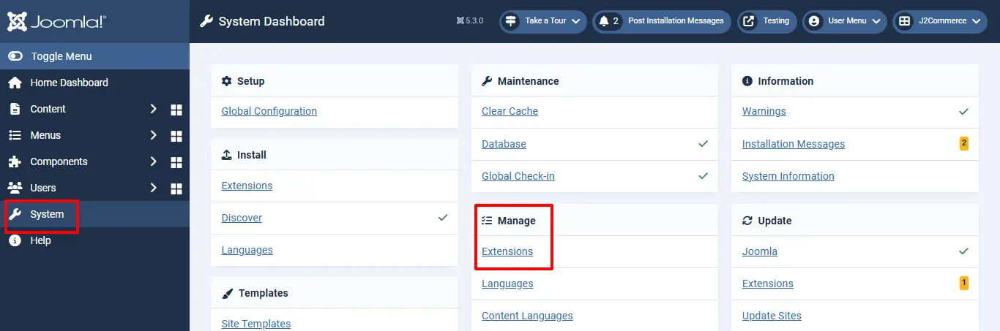
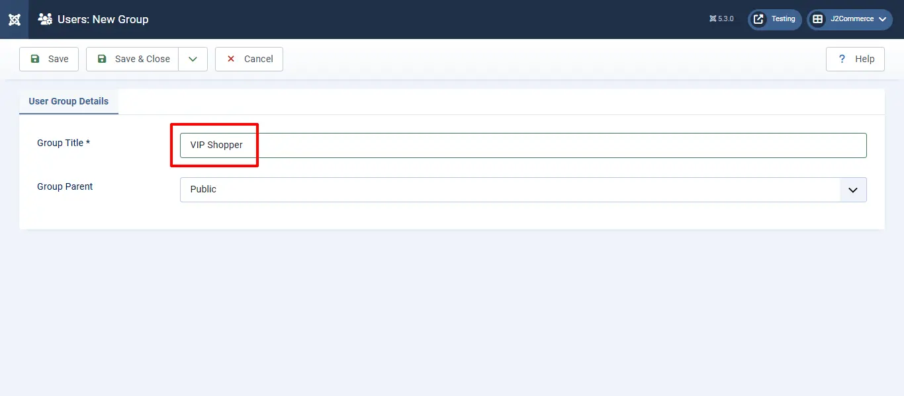

# Add to user group

The Purpose of this app is to add the users to the user group for selected order status and product selected groups.

## Requirements 

* PHP 8.1.0 +
* Joomla! 4.x/ Joomla! 5.x +
* J2Commerce / J2Store 4.x +

## Installation Instructions 

**Step 1:** Go to our [J2Commerce website](https://www.j2commerce.com/) > Extensions > Apps

<figure><figcaption></figcaption></figure>

**Step 2:** Locate the Add to User Group App > click View Details > Add to cart > Checkout.&#x20;

**Step 3:** Go to your My Download under your profile button at the top right corner and search for the app. Click Available Versions > View Files > Download Now

<figure><figcaption></figcaption></figure>

**Step 4:** Use the Joomla! installer to install the app. Go to System > Install > Extensions > Download the app

<figure><figcaption></figcaption></figure>

**Step 5:** Go back to System > Manage > Extensions. &#x20;

<figure><figcaption></figcaption></figure>

**Step 6:** Search for the app and enable it.

<figure><figcaption></figcaption></figure>

Now you can create as many unique groups as you need so you can organize your customers.  This will be very helpful when wanting to send a specific group of customers marketing material, promotions, new products, etc.&#x20;

For example: If your customer is buying a digital product you can add them to a special digital group or if they are an important shopper you can add them to a VIP shopper group and give them special access to certain products or documents.

**Step 7:** To create a new group go to Users > groups > New. Now name it whatever you want. In this example we have named it VIP Shoppers.&#x20;

<figure><figcaption>
Creating a new user group
</figcaption></figure>

<figure><figcaption>
Naming your new user group
</figcaption></figure>

**Step 8:** To add a certain user group to a specific product: Open the product the Article Manager > J2Store Cart > Apps > Add your new User Group

<figure><figcaption>
Add User Group to a product
</figcaption></figure>

## Configuration 

If you want to make sure your App is enabled you can go to Components > J2Commerce > Apps > find your app and click on it.

<figure><figcaption></figcaption></figure>

**Order Status**

Selected order status here will be compared with the order status of the order made by the user. For example, if you set the order status as confirmed and if the user’s order status is also in confirmed then the user will be moved to the user group selected in the product.

.webp>)

**Support**

Still have questions? You can post in our support forum: [Click here](http://j2store.org/forum/index.html)

Thank you for using our extension.
