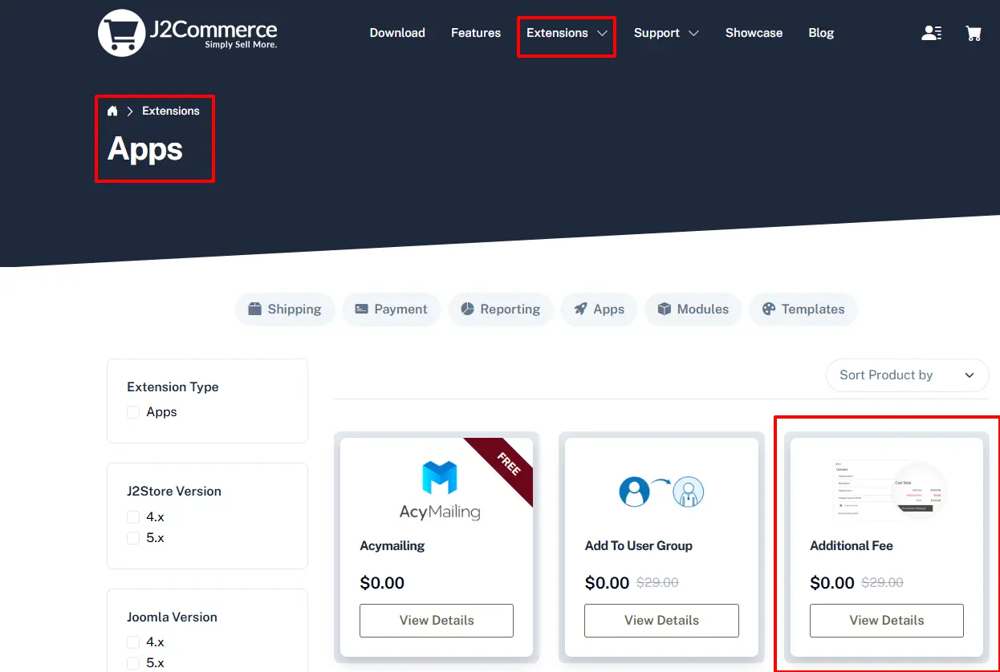
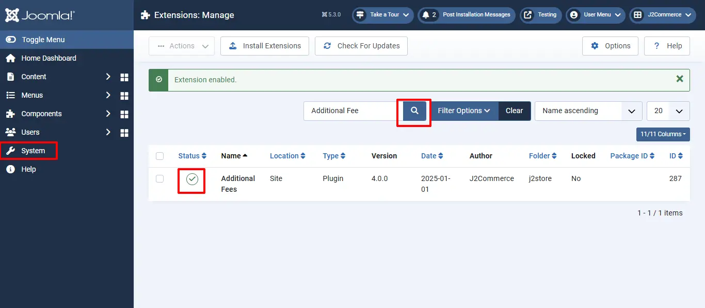
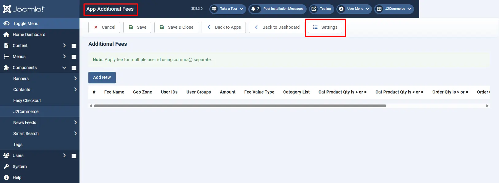
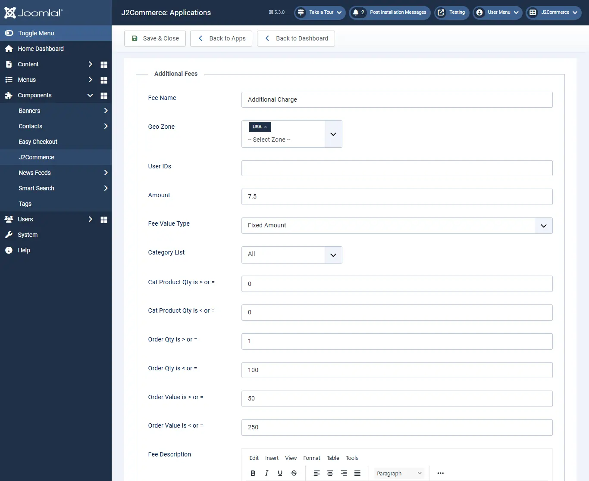

# Additional fee

## Requirements 

1. PHP 8.1.0 +
2. Joomla! 4.x/ Joomla! 5.x +
3. J2Commerce / J2Store 4.x +

## Installation 

**Step 1:** Go to our [J2Commerce website](https://www.j2commerce.com/) > Extensions > Apps

<figure><figcaption></figcaption></figure>

**Step 2:** Locate the Add to User Group App > click View Details > Add to cart > Checkout.&#x20;

**Step 3:** Go to your My Download under your profile button at the top right corner and search for the app. Click Available Versions > View Files > Download Now

**Step 4:** Use the Joomla! installer to install the app. Go to System > Install > Extensions > Download the app

.webp>)

**Step 5:** Go back to System > Manage > Extensions.

<figure><figcaption></figcaption></figure>

**Step 6:** Search for the app and enable it.

<figure><figcaption></figcaption></figure>

## Settings 

Now it's time to open the app and configure the settings.&#x20;

**Step 1:** Go to Components > J2Commerce > Apps&#x20;

<figure><figcaption></figcaption></figure>

**Step 2:** Open the app and click the settings button on top right.

**Additional fee should be calculated per**

You can choose whether the additional fee should be applied based on cart or per product level.

* **Order:** This will apply the additional fee globally i.e. based on the cart.
* **Line item:** This will apply the additional charge based on the product. You can set additional fee to the product individually in the apps tab on j2store cart. Once you enabled Line item, the amount / charge will be applied to the individual products.

**Order price range based on**

Here you can define whether the order total after applying additional fee should be calculated based on subtotal or based on subtotal including shipping price.

**Auto apply additional fee in checkout ?**

Set **YES** will apply the additional fee at the checkout automatically. Set **NO** will hide the additional fee displaying in cart page and checkout and it will display the checkbox at the payment step allowing customers to choose the fees.

**Display a checkbox in the following checkout step**

You can change the position of checkbox by selecting either **Display before shipping method** or **Display after payment methods**.

**Tax Profile**

Select your tax profile to display the additional fee as taxable.

## Additional Fee Setup 

Open the app and click **Add New** button to create new one.

**Name of the fee:** Enter the name for additional fee. The value given here will be displayed during checkout.

**Geo Zone:** Restrict applying additional charge based region. If you wants to apply extra charge only for customers from United States, then create the geo zone for US and assign it here.

**User IDs:** You could also apply the charge only to specific customer by adding user id of the customers here. You can add multiple user ids with comma(,) separated.

**User groups:** It is also possible to restrict additional fee by user group. The additional fee will be applicable to the customers belongs to the user group selected here.

**Amount:** Enter the amount to be charged.

**Fee value type:** Choose whether the additional charge should be the fixed price or based on percentage.

**Category list:** If you would like to apply the extra charge by category wise, then all you have to do is select the category to which the additional fee should be applied.

**Apply when category product quantity is greater than or equal to and Apply if category product quantity is less than or equal to:** If you wants to apply the fee for the particular quantity range of the product from the particular category chosen above, specify the quantity range here.

**Apply when total order quantity is greater than or equal to:** Enter the quantity range. For example, set quantity range **2**. So additional fee will be applied when the quantity reaches **2** or **above 2**.

**Apply if total order quantity is less than or equal to:** Additional fee will be applied when the quantity reaches the value entered here. For example, set quantity range **2**. So additional fee will be applied when the quantity reaches **2** or **less than 2**.

**Apply when total order value is greater than or equal to:** Additional fee will be applied when the total order price reaches the value entered here. For example, set value **50**. So the charge will be applied when order value becomes **50** or **above 50**.

**Apply if total order value is less than or equal to:** Additional fee will be applied when the total order price reaches the value entered here. For example, set value **40**. So the charge will be applied when order value becomes **40** or **less than 40**.

## Additional Fee Setup at product level 

* Go to Content > Article
* Open the article / product > J2Store cart tab.
* Navigate to the Apps tab and click add new button to setup the additional fee for that product. Refer the below screenshot.

### Frontend 

If Auto apply additional fee in checkout is set to **NO**,

If Auto apply additional fee in checkout is set to **YES**,

