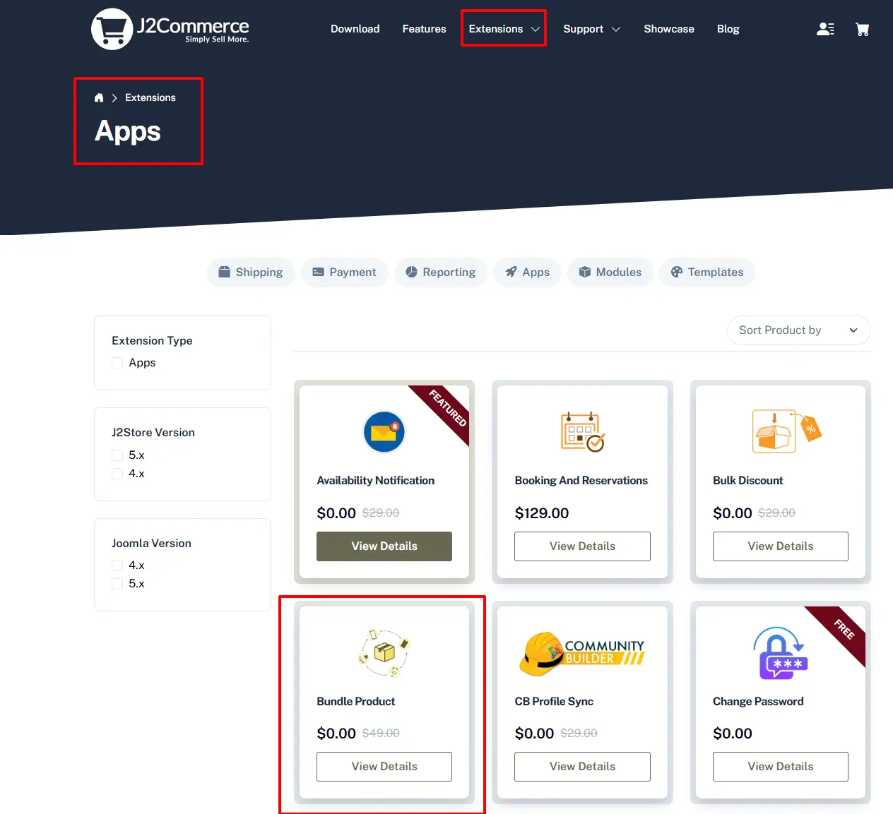

# Bundled Products

This app allows store owner to combine the products and sell it as one single product. When bundling products, the app will allow only simple, configurable and downloadable product types without options. Product which are having options can’t be added.

## Requirements 

1. PHP 8.1.0 +
2. Joomla! 4.x/ Joomla! 5.x +
3. J2Commerce / J2Store 4.x +

## Installation 

**Step 1:** Go to our [J2Commerce website](https://www.j2commerce.com/) > Extensions > Apps

<figure><figcaption></figcaption></figure>

**Step 2:** Locate the Add to User Group App > click View Details > Add to cart > Checkout.&#x20;

**Step 3:** Go to your My Download under your profile button at the top right corner and search for the app. Click Available Versions > View Files > Download Now

<figure><figcaption></figcaption></figure>

**Step 4:** Go to System > Install > Extensions > Download the app

<figure><figcaption></figcaption></figure>

**Step 5:** Go back to System > Manage > Extensions.

<figure><figcaption></figcaption></figure>

**Step 6:** Search for the app and enable it.

<figure><figcaption></figcaption></figure>

## Settings 

Now it's time to open the app and configure the settings. &#x20;

**Step 1:** Go to Components > J2Commerce > Apps. Search for Bundle Products.

<figure><figcaption></figcaption></figure>

**Step 2:** Click on the Open option and choose the Inventory handling type required.

Handle at the items in the bundle Inventory will apply for the products in bundle

Handle at the bundle level Inventory should be maintained for the bundled product

<figure><figcaption></figcaption></figure>

&#x20;**Bundle Products**

1. Once you enabled the app, you can see Bundle Product as one of the product types listed in the product type dropdown. Refer the picture below&#x20;

<figure><figcaption></figcaption></figure>

1. Select the product type Bundle Product and click save.

1. Go to J2Store cart and scroll down where you can see the navigation menus (General, Pricing, Inventory, Images, Shipping, Filters, Relations, Apps)
2. In general tab, choose YES to visible in storefront and navigate to apps.
3. Then navigate to several tabs (Pricing, Inventory, Images, etc) to add price, image, maintain stock.
4. Go to apps tab where you can see the search box to search for the products.
5. Type two or three characters of your product

**\*\* If the product you are searching for is not listed, the reason is that the product might be having the following:**

Product may have options. The product searched may be a Variable product type since this app allows only the product without options and variables, the product with options cannot be added into the group.

1. **Enable Bulk Discount:** If you wish to have a bulk discount for all the products added then set this to yes.
2. **Discount type:** Choose the discount type which you wish to apply

FIXED AMOUNT PER PRODUCT  Set a fixed discount rate according to the product. CART PERCENTAGE: A given percentage of amount will be deducted from the total cart amount.

* Promotional text to show under each item in the cart (only for cart page):

Enter the text you wish to display under each item. This text entered here will be displayed only in the cart page.

* ADD BULK DISCOUNT :

If you wish to have a bulk discount for the products included then you can make use of this option.

QTY: Enter minimum quantity to be added to avail this discount.

Customer group: Enter the user group who can avail this discount.

Discount value: Enter the amount to be deducted from the total price as discount.

* Once the products are added, save article and check in the front end.

Video Tutorial

You can watch the video tutorial for Creating bundled product


