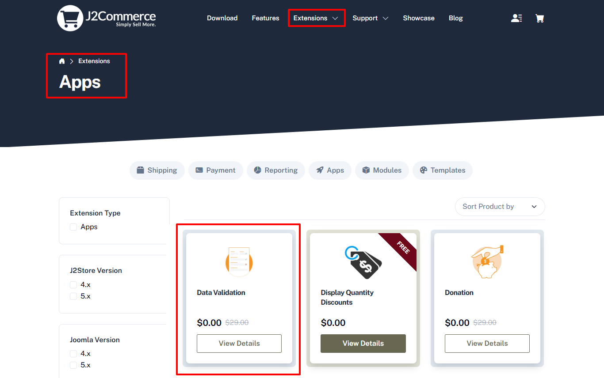
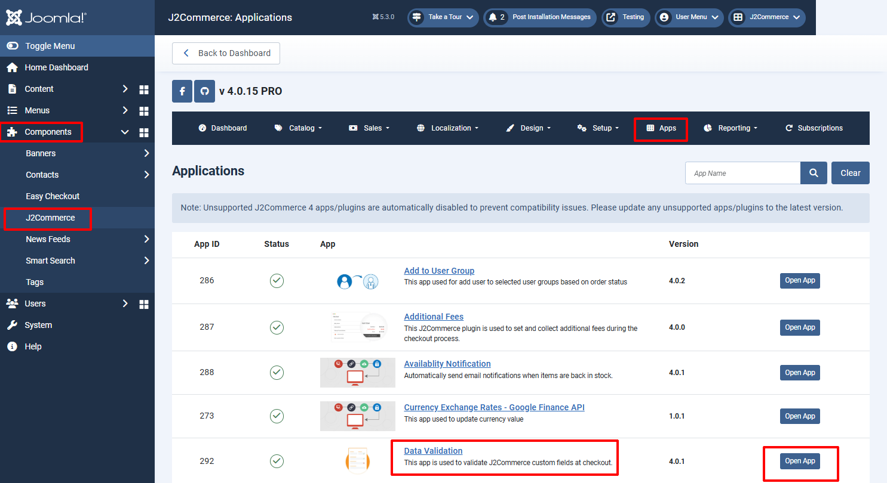
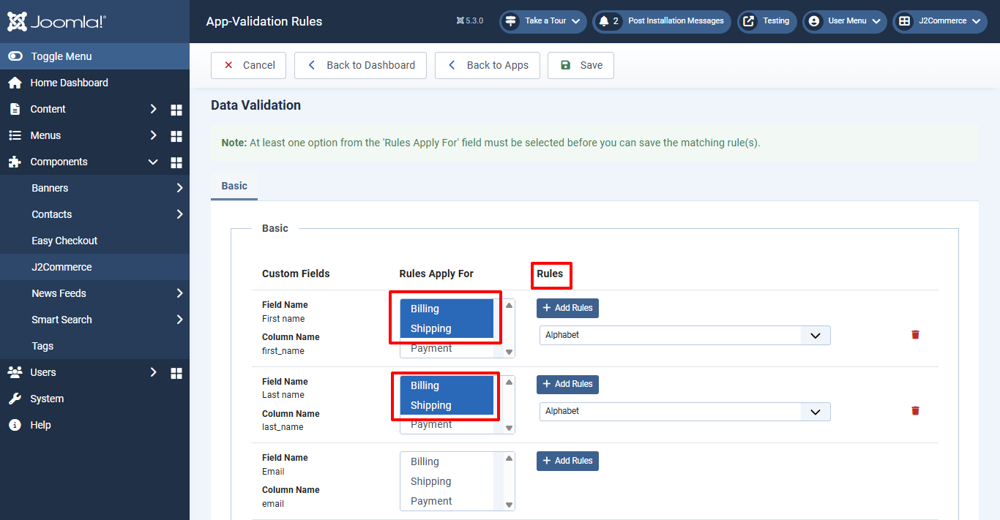

# Data validation

The data validation app is especially useful in the checkout page. With the data validation app you can create rules so that only valid data from the customer is accepted into the various checkout fields. A checkout field that requires the phone number of the customer can be configured to accept only a number input from the customer. You can also set it to reject special characters and alphabets. This way the customer will be informed to only enter a valid phone number, address or any other details in the checkout field.

## Requirements 

1. PHP 8.1.0 +
2. Joomla! 4.x/ Joomla! 5.x +
3. J2Commerce / J2Store 4.x +

## Installation 

**Step 1:** Go to our [J2Commerce website](https://www.j2commerce.com/) > Extensions > Apps

<figure><figcaption></figcaption></figure>

**Step 2:** Locate the Data Validation App > click View Details > Add to cart > Checkout.&#x20;

**Step 3:** Go to your My Download under your profile button at the top right corner and search for the app. Click Available Versions > View Files > Download Now

<figure><figcaption></figcaption></figure>

**Step 4:** Use the Joomla! installer to install the app. Go to System > Install > Extensions > Download the app

<figure><figcaption></figcaption></figure>

**Step 5:** Go back to System > Manage > Extensions.

<figure><figcaption></figcaption></figure>

**Step 6:** Search for the app and enable it.

<figure><figcaption></figcaption></figure>

## Settings 

Now it's time to open the app and configure the settings.&#x20;

**Step 1:** Go to Components > J2Commerce > Apps

<figure><figcaption></figcaption></figure>

**Configuration**

Opening the app will show you 3 column table.

* Custom fields
* Rules Apply for
* Rules

**Custom Fields**

All the custom field you have in J2Commerce custom fields section (Components > J2Commerce > Setup > Custom fields) will be listed in this column.

**Rules Apply for**

You can choose at which section (Billing, Shipping, Payment) the rule should be applied. Choose Billing or shipping or payment or all the three.

**Rules**

Click on “Add Rules” button will display the dropdown lists six types of rules. You can select the rule to be applied from the dropdown list.

**Available rules are:**

Max. length, Min. length, Numeric, Alphabet, Alphanumeric, Phone

You can add multiple rules to every individual field.

<figure><figcaption></figcaption></figure>

**Example**

If you would like to apply rules for the field “Mobile” so that customer should enter only number in the field.

Go to the field Mobile and navigate to the column Rules Apply for and choose the section where you actually would like to apply the rules. If you choose Billing, the validation rule will be applied only at Billing section.

Now move to the column “Rules” and click Add Rules button. Choose the rules from the dropdown list. In our case, choose Numeric and click save button.

**Screenshots**

