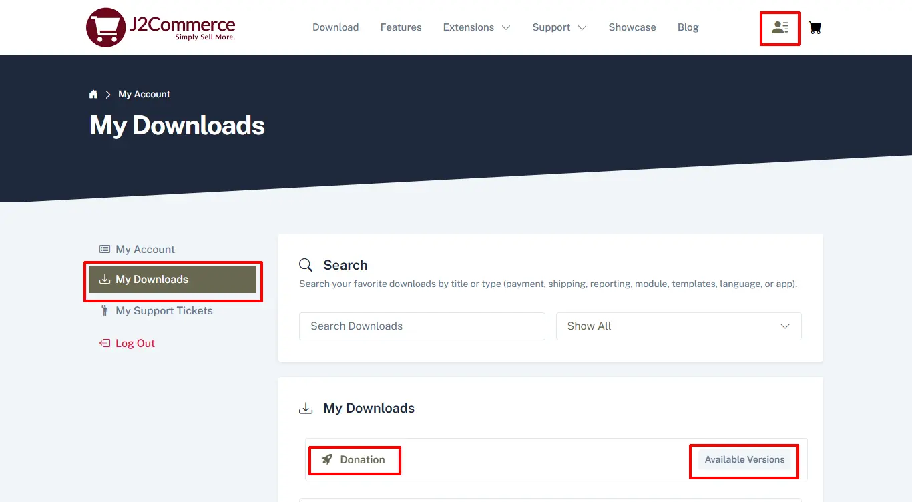
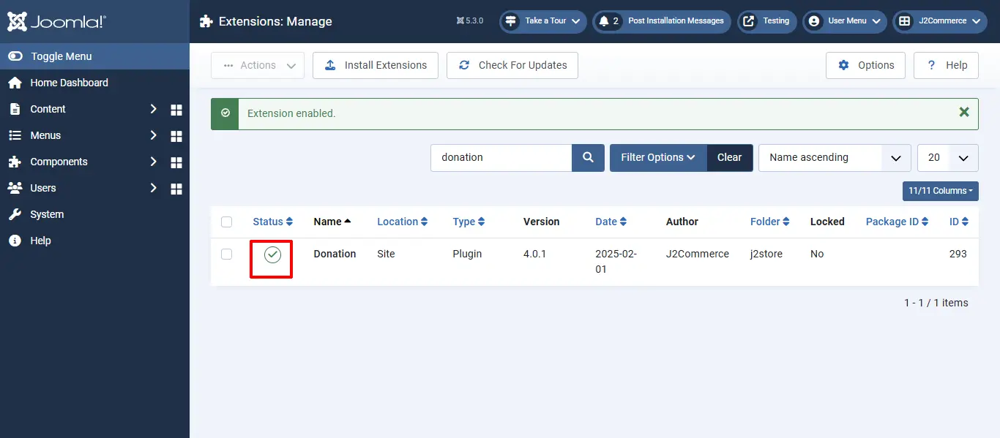
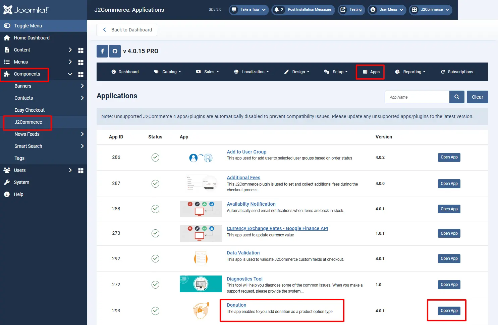
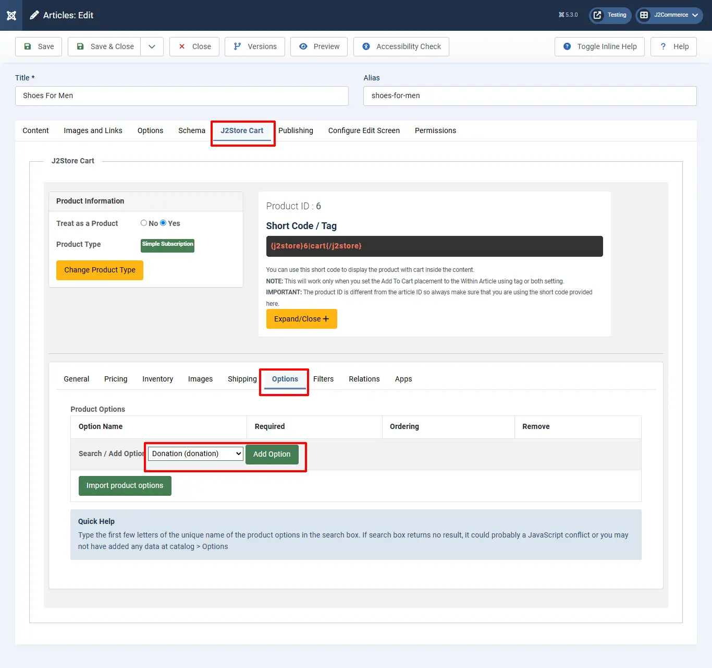

# Donation

The app adds donation as a product option, allowing the store owners to collect donation in addition to selling their products.

The customer will be able to enter the amount of the donation in a text box. You give the liberty of choosing the amount to your user.

The app seamlessly integrates with J2Commerce. You will be able to create a donation option type and associate it with the product. No complex configuration is required to use this app. Just install the plugin over your site, start creating option and add it to as many products as you like.\\

## **Limitations:**

When using the donation option type, avoid using another option with a price modifier (_**like a select or radio type option that adds / modifies the price**_)

## Requirements 

1. PHP 8.1.0 +
2. Joomla! 4.x/ Joomla! 5.x +
3. J2Commerce / J2Store 4.x +

## Installation 

**Step 1:** Go to our [J2Commerce website](https://www.j2commerce.com/) > Extensions > Apps

<figure><figcaption></figcaption></figure>

**Step 2:** Locate the Donation App > click View Details > Add to cart > Checkout.&#x20;

**Step 3:** Go to your My Download under your profile button at the top right corner and search for the app. Click Available Versions > View Files > Download Now

<figure><figcaption></figcaption></figure>

**Step 4:** Use the Joomla! installer to install the app. Go to System > Install > Extensions > Download the app

<figure><figcaption></figcaption></figure>

**Step 5:** Go back to System > Manage > Extensions.

<figure><figcaption></figcaption></figure>

**Step 6:** Search for the app and enable it.

<figure><figcaption></figcaption></figure>

## Settings 

Now it's time to open the app and configure the settings.&#x20;

**Step 1:** Go to Components > J2Commerce > Apps&#x20;

<figure><figcaption></figcaption></figure>

## How to Set Donation Option for a Product?

Once you have enabled the Donation App under Components > J2Commerce > Apps, then you may consider creating an Option of the type of Donation by navigating to Components > J2Commerce > Catalog > Options > New.&#x20;

<figure><figcaption></figcaption></figure>

Name it Donation, the type is Donation, and make sure it's Published.

Once you have created the Option type as Donation you may add the option type to your desired product that you wish to receive the donation for by navigating to Components > J2Commerce > Catalog > Products > Select your product.

Under J2Store cart tab > Options tab > Select the Donation option you created and click on Add option. Select Donation from dropdown menu and click Save and Close

Now your store frontend should display the Donation option for the respective Product.

