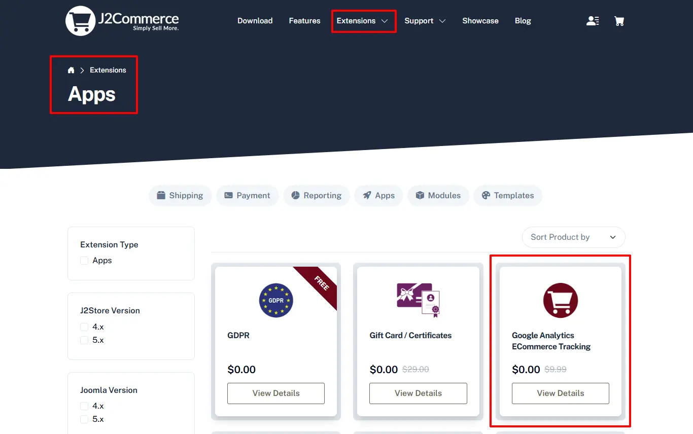

# Google-analytics-ecommerce-tracking

The apps allows you to track the sales, your customers and their behavior. This helps you understand your customers and implement better marketing efforts.

## Installation 

**Step 1:** Go to our [J2Commerce website](https://www.j2commerce.com/) > Extensions > Apps

<figure><figcaption></figcaption></figure>

**Step 2:** Locate the Add to User Group App > click View Details > Add to cart > Checkout.&#x20;

**Step 3:** Go to your My Download under your profile button at the top right corner and search for the app. Click Available Versions > View Files > Download Now

**Step 4:** Use the Joomla! installer to install the app. Go to System > Install > Extensions > Download the app

<figure><figcaption></figcaption></figure>

**Step 5:** Go back to System > Manage > Extensions.

<figure><figcaption></figcaption></figure>

**Step 6:** Search for the app and enable it.

**Set up Ecommerce Tracking in Google Analytics Account**

You need to enable Ecommerce reporting in the view in which you want to see the data.

* Sign in to your Google Analytics account.
* Navigate to the desired account, property and view.
* In the VIEW column, select Ecommerce Settings.
* Click the toggle ON.
* Optional: Turn ON Enhanced Ecommerce.
* Click Submit.

**Setting up the Application**

Now it's time to open the app and configure the settings.&#x20;

**Step 1:** Go to Components > J2Commerce > Apps. Enable the Google Analytics ECommerce App. Open it to configure it

**Tracking ID:** Enter your Google Analytics Tracking ID (Example: UA-XXXXX-X)

**Tracking Type:** If you know which type of analytics is enabled in your account, then you choose the type of Javascript library here. Otherwise, leave it as Classic Google Analytics.

**Category / variations:** You can choose to send the product category or the variation data to Google Analytics. It may sometime cause issues. If you think you are not receiving the Analytics data in your account, then set this to NONE.
