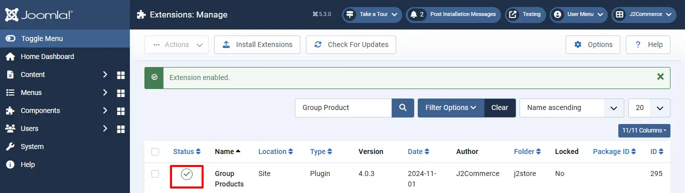
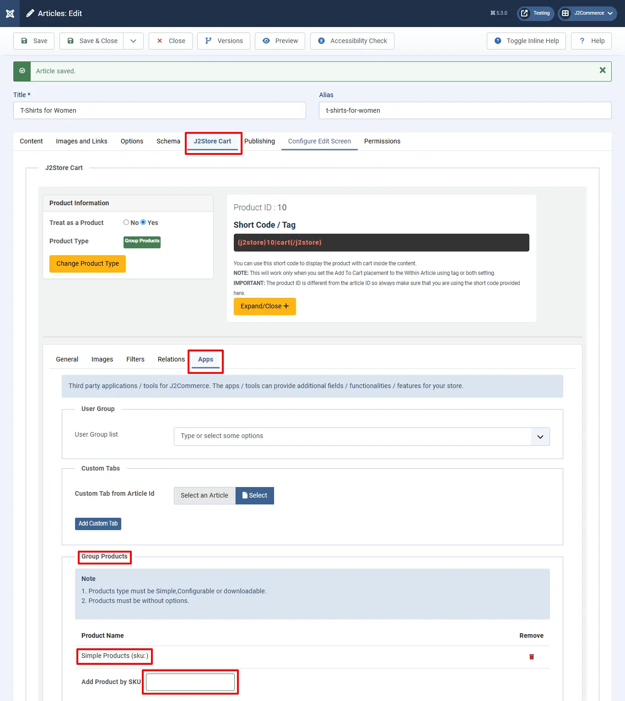

# Group Products

This app allows store owners to combine the products and sell them as one product group. When grouping products, the app will allow only simple, configurable, and downloadable product types without options. Products which are having options can’t be added to the group.

## Requirements 

1. PHP 8.1.0 +
2. Joomla! 4.x/ Joomla! 5.x +
3. J2Commerce / J2Store 4.x +

## Installation 

**Step 1:** Go to our [J2Commerce website](https://www.j2commerce.com/) > Extensions > Apps

<figure><figcaption></figcaption></figure>

**Step 2:** Locate the Group Products App > click View Details > Add to cart > Checkout.&#x20;

**Step 3:** Go to your My Downloads under your profile button at the top right corner and search for the app. Click Available Versions > View Files > Download Now

<figure><figcaption></figcaption></figure>

**Step 4:** Use the Joomla! installer to install the app. Go to System > Install > Extensions > Download the app

<figure><figcaption></figcaption></figure>

**Step 5:** Go back to System > Manage > Extensions.

<figure><figcaption></figcaption></figure>

**Step 6:** Search for the app and enable it.

<figure><figcaption>
enable app
</figcaption></figure>

Once enabled, you don't need to configure anything in the app. Just create a new article by going to Content > Article > New and clicking New Article.

**Group Products**

Once you have enabled the app, you can see Group Products as one of the product types listed in the product type dropdown. Refer to the picture below

<figure><figcaption>
group product type
</figcaption></figure>

* Select the product type 'Group Products' and click save.

<figure><figcaption></figcaption></figure>

* Go to 'J2Commerce' (or J2Store cart) tab and scroll down where you can see the navigation menus (General, images, Relations, apps)
* In the 'general' tab, choose 'YES' to be visible in the storefront and navigate to apps.
* Go to the 'apps' tab, where you can see the search box to search for the products.
* Type two or three characters of your product. You can either type the name or SKU #.
* If the product you are searching for is not listed, the reason is that the product might have /variants. Since this app allows only the product without options/variants, the product with options cannot be added into the group.

<figure><figcaption></figcaption></figure>

* Once the products are added, save the article and check in the frontend.

**Usecase**

Let’s imagine the scenario where you own an online bookstore and you wish to sell both the physical book and the digital copy of the book; then, grouped products could be a boon to you.

Grouped product comes in handy, especially when you don’t want the user to go searching for the physical book in two different places, and when you wish to allow the buyer to choose whether to buy the physical product or the digital copy of the product. Now, let us get to know how to create a grouped product for the above scenario.

Procedure to be followed

* Create a simple product for the physical product, specifying the images, price, discount, and stock information, if any.
* Create a downloadable product for the digital product, mentioning the product price, file to be downloaded after purchase, download limit, link expiry limit, and so on.
* Create a product of the type “Grouped product”.
* Navigate to the Apps section, and you will find the option to add other products to the group.
* Add the products that you wish to group into a bundle and save the article.
* Associate the grouped product with a category and link that category to a menu.
* Now the grouped product will be available at the frontend.

**Video Tutorial**

You can watch the video tutorial for Group Product app


