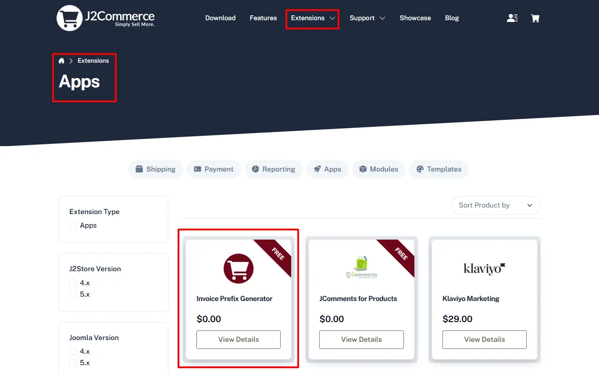
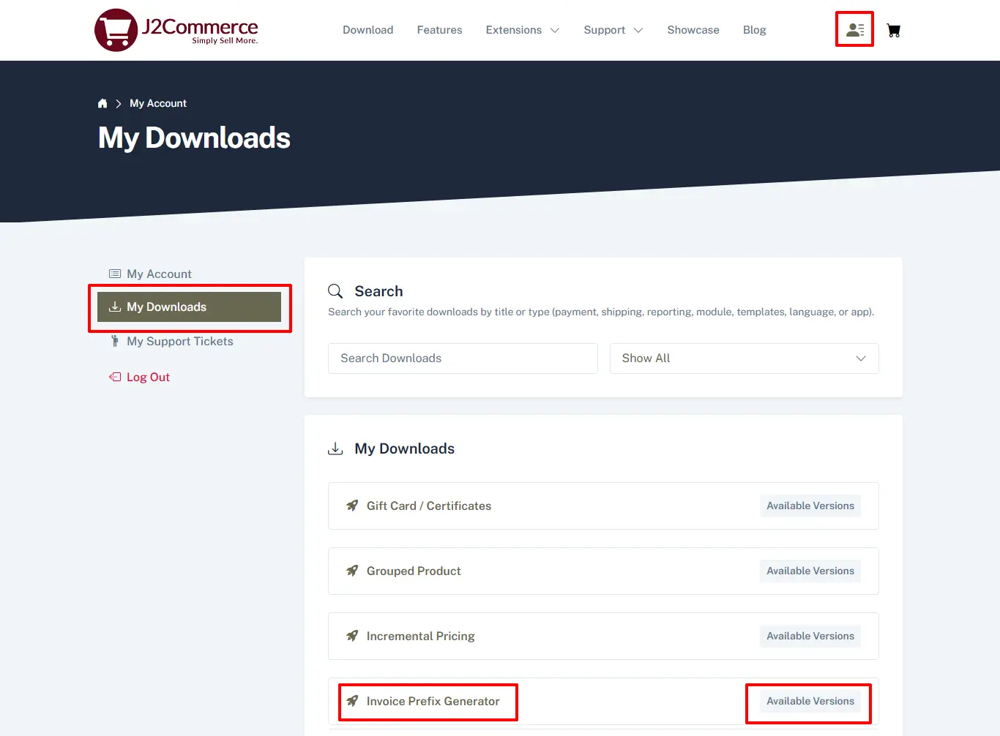
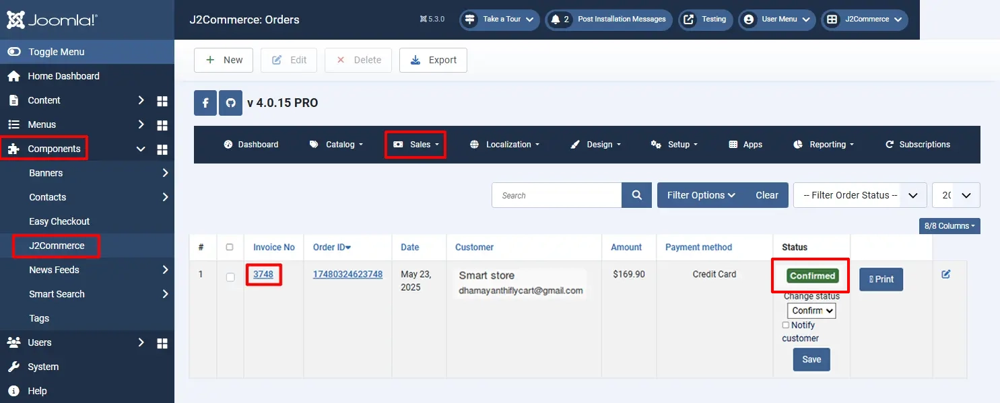
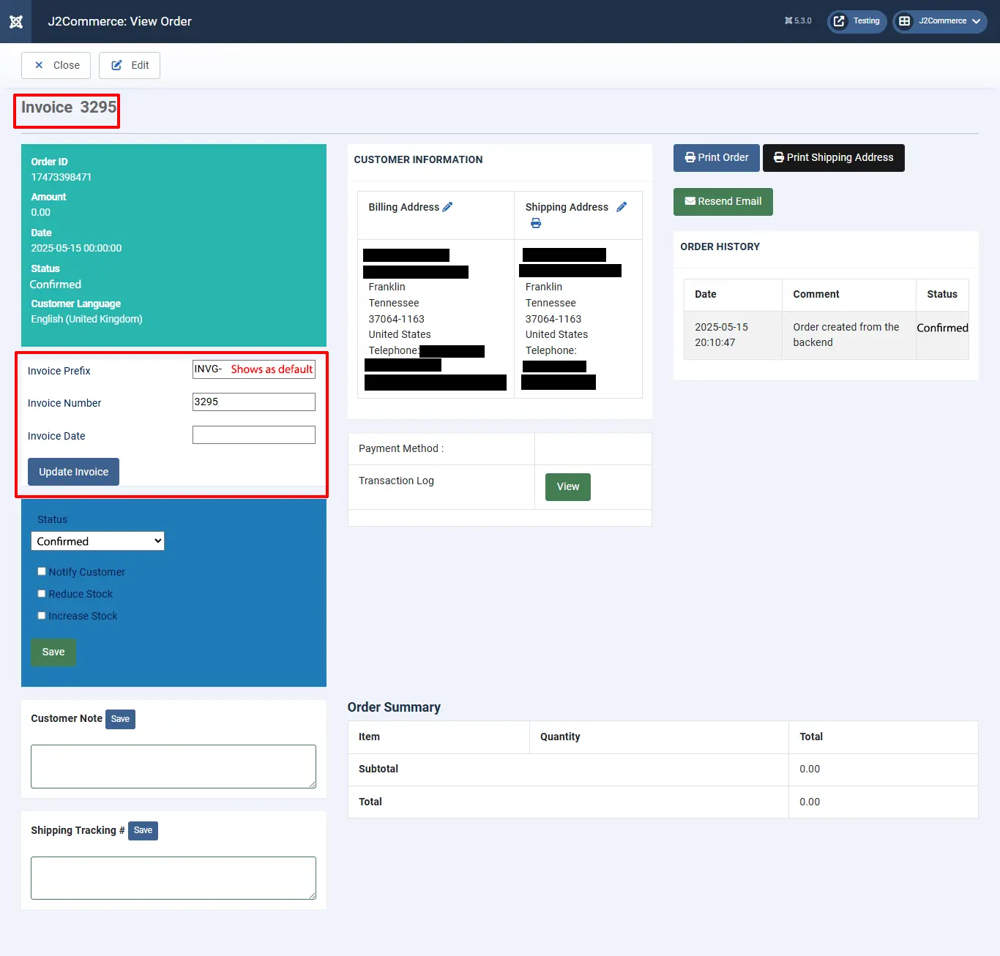

# Invoice Prefix Generator

This app allows you to generate a sequential invoice number for orders with **Confirmed** status using the prefix you have entered in the app. You can also add it to All statuses, not just confirmed.&#x20;

For example, customer adds products to the cart but does not complete the order, but there is still an invoice number generated.

**Here is the reason for generating invoice number:**

Quite a number of gateways including PayPal require an invoice number be sent along with the payment request. Some gateways like Mollie require you to register the order with invoice number even before the payment is processed. So an invoice number is kind of mandatory in those gateways.

**Features**

* Generate sequence invoice number for orders with status “CONFIRMED”.
* The default invoice number (used by J2Store / J2Commerce) would be used for all orders with the NEW status. You can treat these numbers as temporary numbers.
* The app also allows you to edit the invoice number and change it manually when required.
* Allows to define number zeros to be displayed after the invoice number.

## Installation 

**Step 1:** Go to our [J2Commerce website](https://www.j2commerce.com/) > Extensions > Apps

<figure><figcaption></figcaption></figure>

**Step 2:** Locate the Invoice Prefix Generator App > click View Details > Add to cart > Checkout.&#x20;

**Step 3:** Go to your My Download under your profile button at the top right corner and search for the app. Click Available Versions > View Files > Download Now

<figure><figcaption></figcaption></figure>

**Step 4:** Use the Joomla! installer to install the app. Go to System > Install > Extensions > Download the app

<figure><figcaption></figcaption></figure>

**Step 5:** Go back to System > Manage > Extensions.

<figure><figcaption></figcaption></figure>

**Step 6:** Search for the app Invoice _Number_ Generator and enable it.

<figure><figcaption>
enable invoice app
</figcaption></figure>

## Settings 

Now it's time to open the app and configure the settings.&#x20;

**Step 1:** Go to Components > J2Commerce > Apps&#x20;

**Configuration**

**Invoice prefix**

The prefix entered here will be used for the sequence invoice number generated.

**Number of leading zeros**

This option allows you to add zeros to be displayed after the invoice prefix and before the invoice number. If you have invoice prefix (for example **INV-**) and leading zeros as 4, then the invoice number would like **INV-0001, INV-2,…,INV-0010**. See the image below shows the leading zeros is set to 3 so the invoice numbers are **INVG-001, INVG-002**,..

.webp>)

The example below shows no invoice prefix or zeros added before the invoice number.

To view your sales orders go to Components > J2Commerce > Sales > Orders

**Automatically generate invoice number**

Choosing YES will generate the invoice number only when the order status matches the status selected below. See the image below.

**Generate an invoice number if the order has one of the selected statuses**

The invoice number will be generated only for the orders with the statuses selected here. For example, if you choose the status “Confirmed” and "Pending", then the invoice number will be generated only for **Confirmed** and **Pending** order status. See the image below

<figure><figcaption></figcaption></figure>

**Allow editing invoice numbers manually**

Choosing this option YES will allow store owner to edit the invoice number by going to Component > J2Commerce > Sales > Orders > Edit order. For example sometimes you may need to change the invoice number for particular order status. In this case, you can use this option to edit the invoice number manually. See the image below

