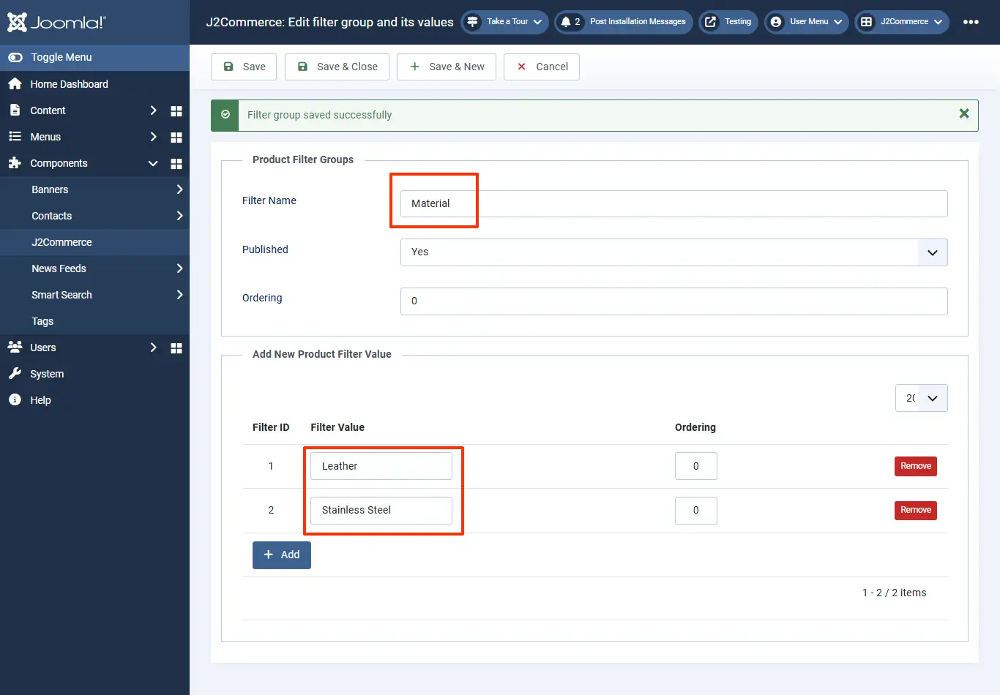

# Adding specifications to your products

## Steps to be followed: 

* Navigate to J2Commerce > Catalog > Filters/ Specifications.

<figure><figcaption></figcaption></figure>

* Create a filter named Material and add values Leather and Stainless steel to the filter.
* Create another filter named Dial Color and add values to it accordingly.

<figure><figcaption>
creating filters
</figcaption></figure>

* Move to the product’s article page and click on the filters section under JJ2Commerce (J2Store Cart) tab.
* Type in the name of the filter’s value created and save the article post adding the filter values.&#x20;

<figure><figcaption>
adding filters to products
</figcaption></figure>

* Navigate to Menu > Manager > Choose your product’s menu item > Product view options > Show specifications > Show > Save
* Now the product’s item view would have the Specifications listed in a separate tab named Specifications.

.webp>)

### Video Tutorial: 


