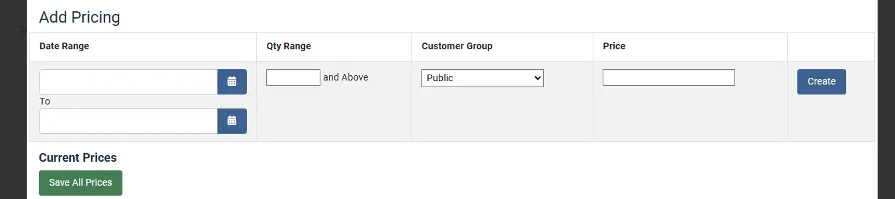

# Advanced Pricing

J2Commerce offers you to set advanced pricing for your product. This functionality enables you to have prices based on the quantity and date range.

The following steps will guide you on how to set advanced pricing for your product.

## Set advanced pricing 

* After creating an article and product type under J2Commerce (J2Store Cart) tab, Select Save.
* Navigate to the J2Commerce (J2Store Cart) tab > Variants. If there are more than one variant then open each specific variant that will receive special advanced pricing. Enter the regular price that you want the public to see.

* Click on Set Prices to set advanced pricing.
* A pop-up screen will open with fields such as Date range , Quantity range, customer group and price.

### How to set up date range based discounts: 

If you are trying to set up date range based discounts, you could do so by setting up advanced pricing as follows:

**Discount date range: 02-04-2019 to 16-04-2019 Regular price of the product: 20 Discounted price: 10**

Navigate to your product article > J2Commerce (J2Store Cart) tab > variants > open variants > pricing > Set Prices > mention the date range in the Date range (optional) field, set the discounted rate and click create.

So when users buy this product, within the above mentioned date range, they would receive the discount mentioned.

### How to set up quantity based discounts: 

This option might be useful when you are trying to set up quantity range based discounts on your products.

**Quantity range: 2 and above Regular price: 20 Discounted price: 10**

With the above setup, when user buys 2 and more quantities of the given product, they would receive each quantity in 10$.

That is when users buys 5 quantities of the product, the total price would be

\_5\*\_10=50 instead of 5\*20=100

### How to setup customer group based discounts: 

When you wish to offer customer-group based pricing, then you could choose the customer groups in the customer group option and set the price accordingly.

**User group eligible for discount: wholesale Regular price: 20 Discounted price: 10**

So, with the above advanced pricing set up, users of the group Wholesale receive discount for the product.

## Creating Advanced pricing: 

* Enter the values in the required fields and click on the create button .

A pop-up message price saved successfully will appear and the value entered will be displayed.

* you can create as many number of advanced pricing sets as per the requirement.

### Frontend Demo 

You could also combine all the conditions such as date range, user group specific and quantity range to offer discounts for your products.

### Video Tutorial: 

The following video demonstrates how to set up advanced pricing on your store:




