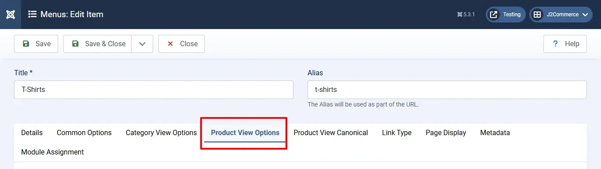

# Manufacturers

This page contains information about the manufacturers of the products that are listed in J2Commerce.

Manufacturers are listed with the following details:

* Company
* Tax Number
* Address
* City
* Zip
* Phone and Mobile
* Country
* Zone

Before you can add a manufacturer to a product, you have to create the manufacturer.&#x20;

**Step 1:** Go to Components > J2Commerce > Catalog > Manufacturer

<figure><figcaption></figcaption></figure>

**Step 2:** Select 'New'

**Step 3:** Fill in all of the boxes with the manufacturer's information

The image shown below is how a manufacturer is added.

## Associating them with products 

To add the manufacturers to the product, follow the below instructions:

* Navigate to Content > Articles. Find your product
* &#x20;Open the Product. Click on J2Commerce (or J2Store cart) > the 'General' tab.
* Click on the manufacturer's dropdown box.
* The list of available manufacturers will be available.
* Choose your manufacturer and save.

* Navigate to Menus > Manage. Find your product’s menu and open it

<figure><figcaption></figcaption></figure>

* Click on the 'Product View Options' tab

<figure><figcaption></figcaption></figure>

* Set the option Brand to 'Yes'

<figure><figcaption></figcaption></figure>

This would display the associated brand on the product view as follows:

**Frontend**

## **Filtering products based on manufacturers/brands:**

Once you associate manufacturers with the appropriate products, you can also let users filter products based on brands.

* Post linking brands with the concerned products. Navigate to Menus > Manage.&#x20;
* Open your product menu > Category View Options tab.

<figure><figcaption></figcaption></figure>

* Scroll down to the Filters section. Set the option: **Manufacturer/brand filter** to Show.
* Set the option **Manufacturer filter listing type** to **Show all filters.**

* Once the manufacturer filters are enabled, the filters would be listed and users can filter the products based on brands.

