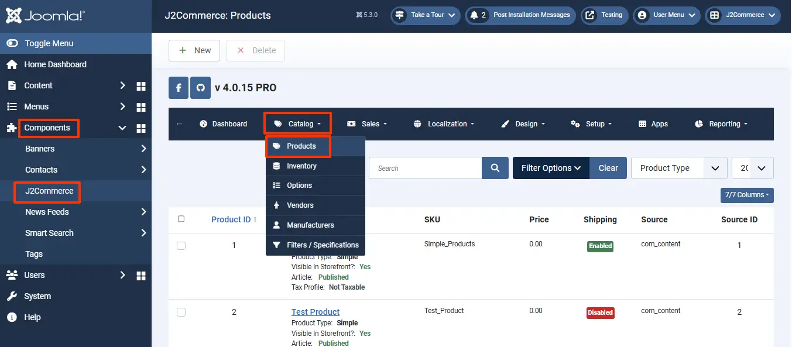

# Setting up tax for your products

## Requirement for the tax to take effect: 

* Geozone has to be set up for which the tax has to apply.
* Tax rate has to be set up.
* Tax profile has to be created.
* Tax rate has to be associated with the tax profile.
* Tax profile has to be assigned to the products for which tax has to be levied.

## Instance: 

Tax geozone: USA

Tax rate: 10%

Tax profile name: US-TAX

**Steps:**

* Navigate to J2Commerce > Localisation > Geozones and create a new geozone.

* Type in a name for the geozone, add the countries for which the tax has to be applied.
* Case A: Apply tax only for few zones within USA.

2\. Case B: Apply tax for all zones within USA.

Navigate to J2Commerce > Localisation > Tax rates > Click new.

Fill in the name, tax percentage, geozone and publish the tax rate.

Navigate to J2Commerce > Localisation > Tax profile > New.

Fill in the profile name, set the status and map the tax rate on the profile, choose the associated address.

Navigate to J2Commerce > Catalog > Products (Or Content > Articles).

Edit the products for which you wish to collect tax. Navigate to the J2Commerce (J2Store Cart) tab. Choose the tax profile and save.

Frontend:

Thus tax would be levied on the product as per the configuration.

### Issues: 

Please refer the following list of troubleshooting steps:

[click here](https://docs.j2store.org/catalog/setting-up-tax-for-your-products/\[http://docs.j2store.org/troubleshooting-guide/troubleshooting-tax-issues]\(%3Chttp:/docs.j2store.org/troubleshooting-guide/troubleshooting-tax-issues%3E\))
