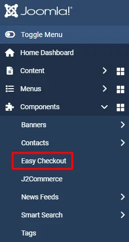
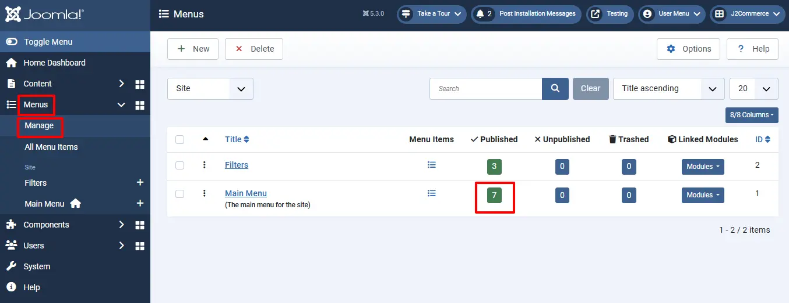
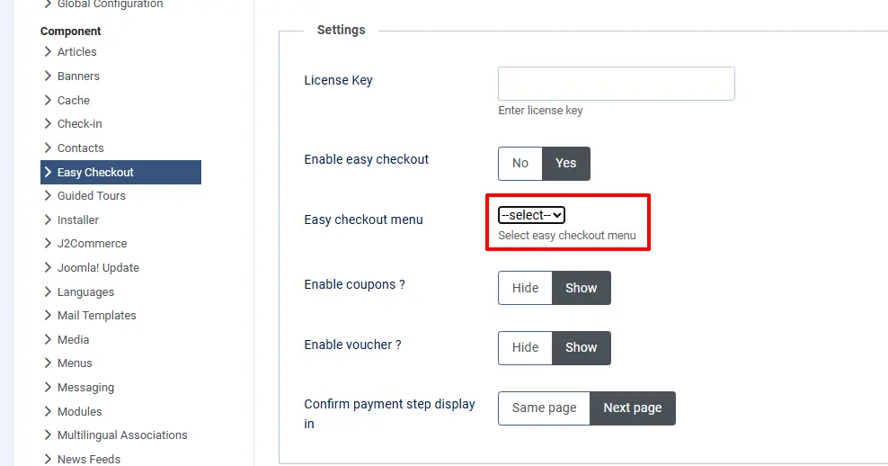

# Easy checkout

With online shopping moving quickly, convenience is becoming a must for customers. Overcomplicating your check out process can result in lost sales and unsatisfied customers. One would think that fewer steps would make it easier for the customer to check out, but that is not always the case.

Here we are coming up with **Easy checkout** for J2Commerce that makes the checkout process easier.

Easy checkout is nothing but an one-page checkout that displays all elements of a standard checkout including basket contents, billing and shipping address, shipping options, and payment information on one page. Originally, one-page checkouts were put into practice in an effort to simplify the check out process with fewer clicks and fewer pages.

It will be easier to complete as less steps can appeal to time-conscious customers.

**Requirements**

1. Joomla! 4.x/ Joomla! 5.x +
2. PHP 8.1.0 +
3. J2Commerce / J2Store 4.x +

**Installation**

Download and install our Easy checkout component using Joomla! installer.

After installing, go to Manage > Plugins and make sure that the plugin System - Easy Checkout has been enabled.

<figure><figcaption></figcaption></figure>

Once you enabled the system plugin, the J2Commerce’s normal checkout will be replaced and the single step checkout will be activated. Once enabled, Easy Checkout will appear in the side menu bar under Components.

<figure><figcaption></figcaption></figure>

Few points that has to be remembered

1. **Guest checkout**

The guest checkout form is a must for all online stores for the customers who don’t want to have an account.

To enable the Guest checkout, go to J2Commerce > Setup > Configuration > Cart tab

Set **YES** to Allow guest checkout

Save.

<figure><figcaption></figcaption></figure>

**2. New account registration**

To enable the New account registration option in Easy checkout,

Go to Component > J2Commerce > Setup > Configuration > Cart tab

Set 'YES' to allow quick new user registration

Save.

<figure><figcaption></figcaption></figure>

If the new user registration option is enabled, you would see a small checkbox labelled **Create an account for later usage** in the checkbox.

This checkbox will be checked automatically.

If customers don’t want to register, they can uncheck the checkbox and proceed further as a guest (Non-registered).

**3. Existing customers**

The existing customers can place the order by using the login form. You would see the login form by clicking on **Login**.

**4. Checkout menu**

The SEF is the most important one for all the online stores. Similar to the Normal checkout, the easy checkout also has the menu item type.

By using this menu type, you can have the SEF URL for the checkout page.

Go to Menus > Manage and create the menu item under Main Menu.&#x20;

Name the menu Checkout.&#x20;

**Select Easy checkout > Checkout**.

<figure><figcaption></figcaption></figure>

<figure><figcaption></figcaption></figure>

**Screenshots**

**Easy checkout is not showing up:**

Even after installing, enabling, and creating a menu for easy checkout, if it is not showing up on the storefront, then this might be a reason.

Navigate to\*\* Components > Easy checkout > Options\*\*

.webp>)

\*\*Select the menu created for easy checkout at the Easy Checkout menu option. If Checkout isn't listed in the dropdown menu, then it's because you skipped the step above, which is creating the menu.

