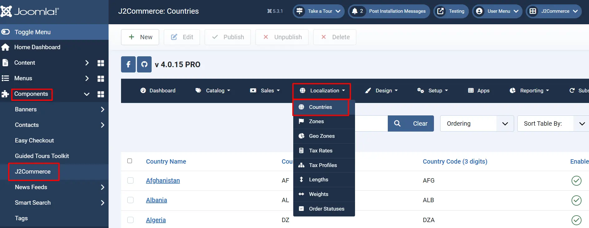
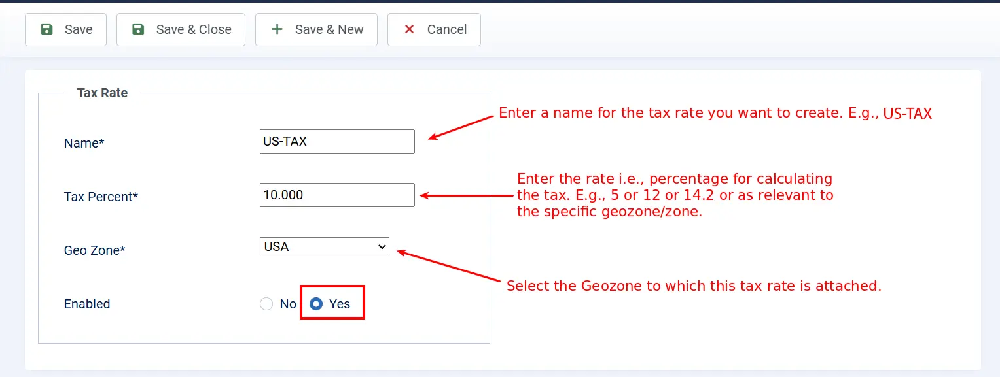
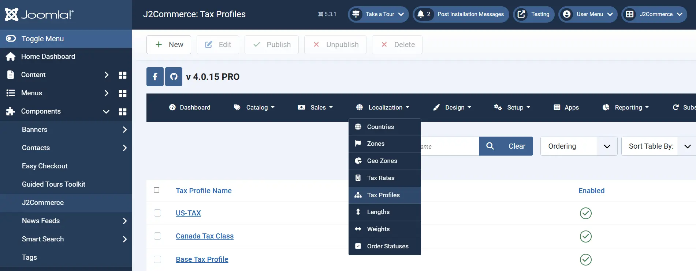
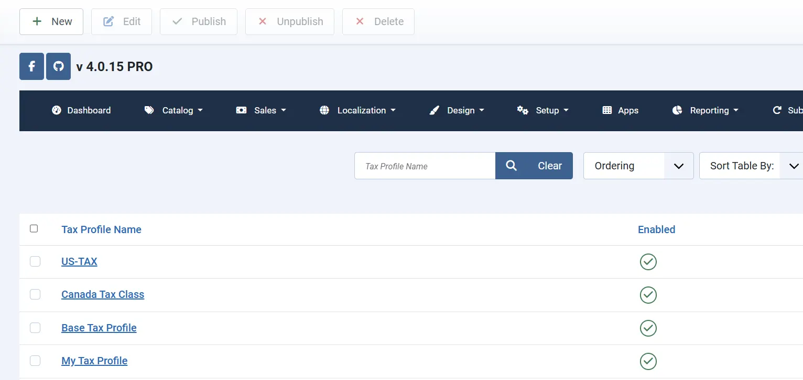
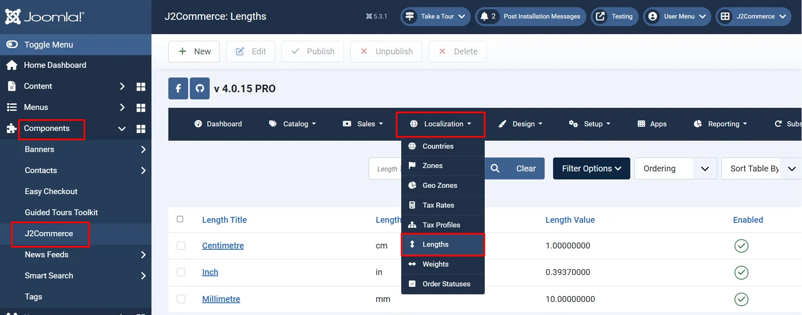
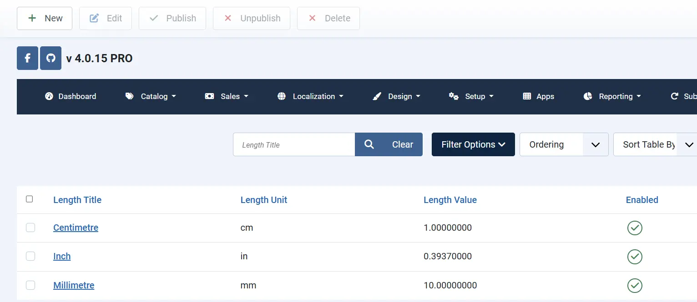
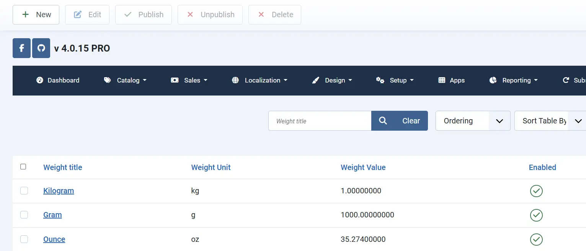
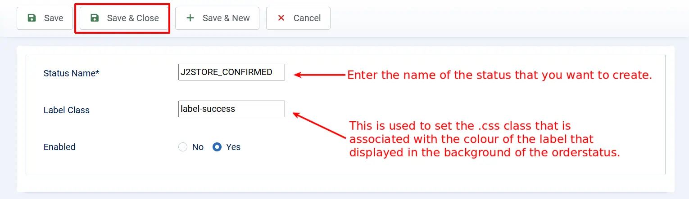

# Localisation

Under the localisation section of J2Commerce dashboard, the following options would be available:

* Countries
* Zones
* Geozones
* Tax rates
* Tax profiles
* Lengths
* Weights
* Order statuses

## Introduction 

These are basically properties that help you to configure your store to your local/regional needs. Primarily for taxation purposes. You can also add/edit countries, zones, group the countries/zones as geozones, length, and weight measurements. You can also create more custom order statuses

Go to Components > J2Commerce > Localization > Countries

<figure><figcaption></figcaption></figure>

## Countries 

A list of most of the countries in the world. You can choose one from the list. If any odd one that is not found in the list, you can very well create that. The fields are:

* Country Name - Name of the country
* Country code - 2-digit international standard code
* Country code - 3-digit international standard code
* Enabled - Published or Unpublished i.e., only if the country is published, it will be available for the customer

Check the image below:

### Adding a new country 

The listing of countries will be like this in your J2Commerce.

## Zones 

Zones are regions that are separated by geographical area for ease of administration purposes, within a country. Generally, in every country, the state or province, as the case may be, is treated as a zone.

Go to Components > J2Commerce > Localization > Zone

<figure><figcaption></figcaption></figure>

Just have a look on the image below, which displays the list of zones.

### Adding new zones 

Almost all the zones are loaded by default in J2Commerce, but if you need to create one as and when the situation arises, you can very well do so, as illustrated in the image below.

The required fields for a zone are as follows and are fairly self-explanatory…

* Zone Name - Name of the new zone
* Zone Code - Code attached to the zone
* Country - Country to which the zone belongs
* Status - Whether it is enabled for use by the customer

<figure><figcaption></figcaption></figure>

## Geozones 

Geozones are created based on geographical locations that have common tax profiles. Geozones are used to set up different tax practices for different countries and zones.

* For instance, if the tax percentage for Europe is set at 5% and for the US at 10%, then two geozones are created for this purpose, and countries belonging to Europe are added to one geozone and the US to the other geozone.

If a geozone is created and saved, then an option row will be displayed to add countries and zones to the new geozone. Like this, any number of zones or countries can be added or removed from geozones.

* In the configuration page, go to the Store tab and create a profile with the United States in the country field and California as the state
* Now, create a geozone with a meaningful name of your choice. In this example, it is ‘Tax 14’
* Map the country and zone in the fields shown below with the United States and California

Go to Components > J2Commerce > Localization > Geozone

<figure><figcaption></figcaption></figure>

See the image



### What is the use of Geozones? 

Geozones are used when you are trying to set tax rates or shipping costs, it becomes necessary to determine where the tax rate or shipping method should take effect. In that case, you will create geozones including the regions where you wish to levy tax or shipping charges and associate it with the tax rate or the shipping method. Geozones would also help you to set up tax or shipping for a particular zone, for example: Levy 20% tax for the California zone alone. In this case, you could create a geozone only for California and associate it with the desired tax rate. You can also restrict payment methods based on geozones.

## Tax rates 

Create tax rates for your region (geozone)

Go to Components > J2Commerce > Localization > Tax Rates

<figure><figcaption></figcaption></figure>

## Tax Profiles 

One or more tax rates are grouped to form a tax profile. You can map the tax rates to either the customer’s billing or shipping address.IMPORTANT: Make sure your taxes are mapped correctly. If you choose Billing here, then in your Configuration - Tax, the Calculate tax based on should also be set to the same address type.

Generally, tax is calculated for the billing address. But in some countries, it is calculated for shipping.

Let an example to help understand how it works. This example assumes that the store is located in the state of California, US.

Now, create a tax rate on that page by entering the sample data.

* Name: Tax
* Tax Percent: 14.2 (Enter only numbers and a single decimal point. No other symbols should be used)
* Geozone: 14.2 (Select the geozone from the list)
* Status: Published

Go to Components > J2Commerce > Localization > Tax Profiles

<figure><figcaption></figcaption></figure>

Now, go to tax profiles and add a new profile.

**Taxprofile Name:** Profile 14.2 (any name of your choice)

Now click the green button ‘Save’ only, and no other button.

Now you can map the tax rates by assigning one to an address type as described below:

**Rate**: select the added ‘Value Added Tax’ from the list.

**Associated Address**: select ‘Billing Address’ from the list.

Check the image below:

## Lengths 

By default, J2Commerce adds the most commonly used length measurements. If you require more measurement units, you can add them here.

**Length Title**

Formal name of the measurement unit for the base quantity length. (e.g. Centimeter)

**Length Unit**

Short form of measurement unit. (e.g. cm)

**Length Value**

This is set to be 1 by default. All other measuring units for base quantity length are relative to the given example unit, and the value entered for those units must be in correlation to this unit.

* For e.g., there are 10 mm in 1 cm. Likewise, 0.39370000 inch is in 1 cm
* Like this, every value should be relative to cm

Go to Components > J2Commerce > Localization > Length

<figure><figcaption></figcaption></figure>

Refer to the image below.

### Adding new length units 

If your desired length unit is not available on the above list, you can add new units, if needed, as illustrated below.

## Weights 

By default, J2Commerce adds the most commonly used weight measurements. If you require more measurement units, you can add them here.

**Weight Title**

Formal name of the measurement unit for the base quantity weight. (e.g. Kilogram)

**Weight Unit (short form)**

The short form of a measurement unit. (e.g., kg)

**Weight Value**

The default value for kg is set to be 1. This should be in relation to other units of measurement.

* For e.g., there are 1000 grams in 1 Kg, and hence the grams should be set to 1000 when Kg is set to 1

Go to Components > J2Commerce > Localization > Weights

<figure><figcaption></figcaption></figure>

### Adding a new weight unit 

If you want to add a new measuring unit for weight, you can do it as illustrated below:

## Order statuses 

By default, J2Commerce comes with the following core order statuses.

* CONFIRMED
* PROCESSED
* FAILED
* PENDING
* NEW
* CANCELLED

Go to Components > J2Commerce > Localization > Order Status

<figure><figcaption>
List of Order statuses
</figcaption></figure>

### To add a new order status 

Sometimes you might want to add new order statuses apart from the ones that are already there. For example, something like **Shipped**. But the shipped status is not available on the default order statuses. In this case, you could create a new order status by following the steps below:

