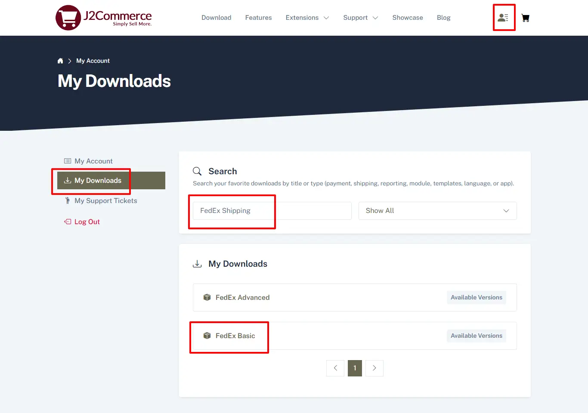
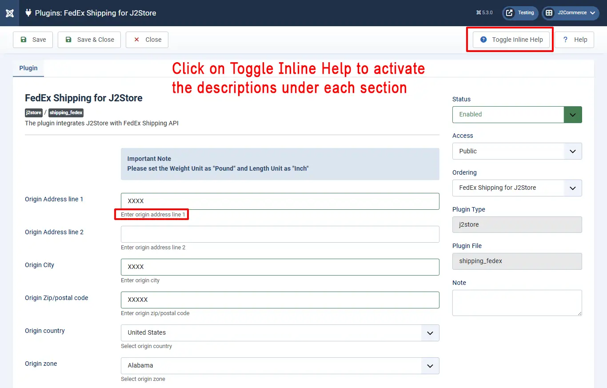
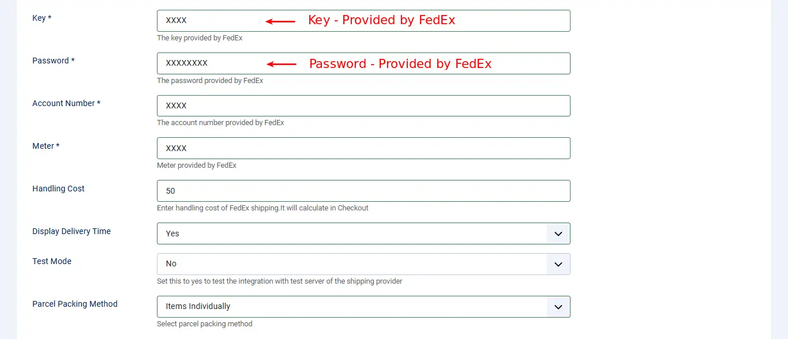

# FedEx shipping plugin

This plugin integrates J2Commerce with FedEx Shipping rate API.

**Requirements**

1. PHP 8.1.0 +
2. Joomla! 4.x/ Joomla! 5.x +
3. J2Commerce / J2Store 4.x +

**Download:**&#x20;

**Step 1:** a) Download the app from our store by going to My Downloads (found under your profile drop-down in the top right corner) b) type in Fedex Shipping in the search bar. c) Click on the Fedex Basic or Advanced App

<figure><figcaption></figcaption></figure>

**Step 2:** Click on the app and then click Download Now

<figure><figcaption></figcaption></figure>

**Installation:** You can install this shipping plugin using Joomla! installer.

* In the J2Commerce admin, go to System > Install > Extensions&#x20;
* Click on the Browse button and select FedEx Shipping Zip file you just saved and install it

<figure><figcaption></figcaption></figure>

* Go back to System > Manage > Extensions
* Type Fedex in the search bar and click the X to enable the plugin

<figure><figcaption></figcaption></figure>

* Go to Componants > J2Commerce > Setup > Shipping Methods

<figure><figcaption>
shipping methods
</figcaption></figure>

* Click View to open the app
* Configure the shipping plugin by entering the plugin parameters

**Parameters:** Consider the images for setting up the parameters.

Here is the instructions for identifying Fedex credentials (Authentication key and meter number). \<link-text url =¨[https://support.shippingeasy.com/hc/en-us/articles/203087899-How-do-I-find-my-FedEx-Meter-Number-”target](https://support.shippingeasy.com/hc/en-us/articles/203087899-How-do-I-find-my-FedEx-Meter-Number-%22target) = ¨\_blank”rel = ¨noopener¨> click here

**Key:** This is a unique FedEx key required to login.

**Password** This is the password provided by FedEx and not your website login password.

**Account Number** This is your FedEx account number.

**Meter** This is your meter number provided by FedEx.

**Handling Cost** If you need to charge a handling cost for the shipping, you can provide it here.

**Display Delivery Time** To show the delivery time, set this option to Yes.

**Test Mode** For live account, set this to No. For test account, set this to Yes.

**Parcel Packing Method:** Select parcel packing method

**Services** You can select one or more services offered by FedEx in this field for display in checkout page.

**Drop Off Type** Here is a list of drop off types and you can select one from the list.

**Packaging Type** Here, a list of packaging types are available, with various dimensions. You can select one or more types.

**Rate Type** Valid values for rate type are:

**Account Type:** This method uses the customers’ account rate as the basis for the calculation of additional charges. List - This type uses the FedEx list rate as the basis for the calculation of additional charges.

**Weight Unit:** If you have not set weight unit in the product, the value chosen here will be used. ie: pounds, ounces, grams

**Length Unit:** If you have not set the length unit in the product, the value selected here will be used. ie: inch, centimeter, millimeter

**Tax Class** If shipping is taxable and you want to add tax rate, select a tax profile in this option.

**Geozone** If you want limit this shipping method to particular areas, then you can select the corresponding geozone in this option. If this shipping is applicable to all areas, then set it to All.

**Debug** If you set this to Yes, then an error log file will be maintained in the cache folder. It suitable for test account. Always set Debug option to **No** in live accounts

**Support** Still have questions? You can reach us in support@j2commerce.com

Thank you for using our extension.
