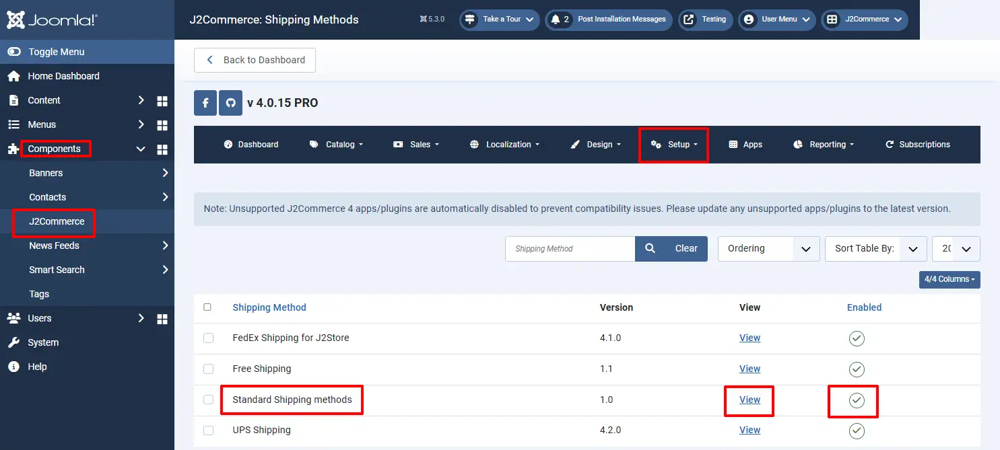

# How to set up local store pick up shipping method

Many a times you might want to display a Store pickup option in the shipping method selection area of your site. Here is how it can be done.

## Methods: 

There are two ways in which the local store pick up method could be shown on the store front.

1. Renaming the free shipping.
2. Creating a shipping method using the standard shipping method.

### Renaming the free shipping: 

**Ideal for:** The following method is ideal when you don’t intend to use the free shipping plugin for other purposes.

**Procedure:**

* Navigate to Component > J2Commerce > Setup > Shipping methods > Free shipping.

* Click on the View option.
* Rename the plugin’s display name to Local store pick up.

* Save the changes.
* Now the free shipping would appear as Local store pick up at the frontend for users who choose the USA region at their address.

**Video Tutorial:**



## Creating a shipping method using the Standard shipping method: 

**Ideal for:**

This process is ideal when you wish to use the Free shipping for other purposes but wish to display a store pickup option to users of a certain region.

**Procedure:**

* Navigate to Components > J2Commerce > Setup > Shipping methods  > Standard shipping methods.
* Click on the View option.

<figure><figcaption></figcaption></figure>

* Click on the New option.

* Set the name as Store pick up and define the other conditions, if any

* Click save and close.
* Click on the set rates button next to the newly created shipping method.

* Choose the geozone (you will have to create one already in Components > J2Commerce > Localisation > Geozones) for which this shipping option should be available.

<figure><figcaption></figcaption></figure>

* Set the rate as 0.
* Click on the create button.

* Now the frontend would show the shipping method for users of the chosen region.

**Video tutorial:**


