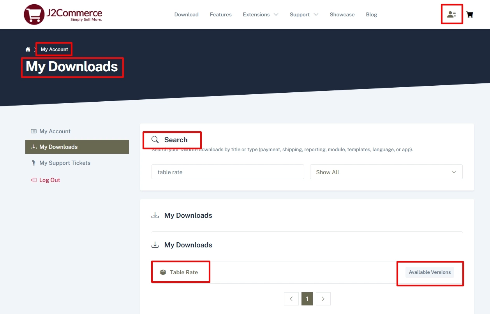
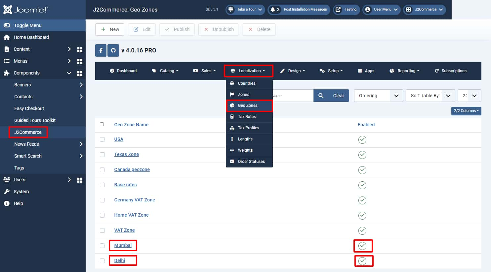
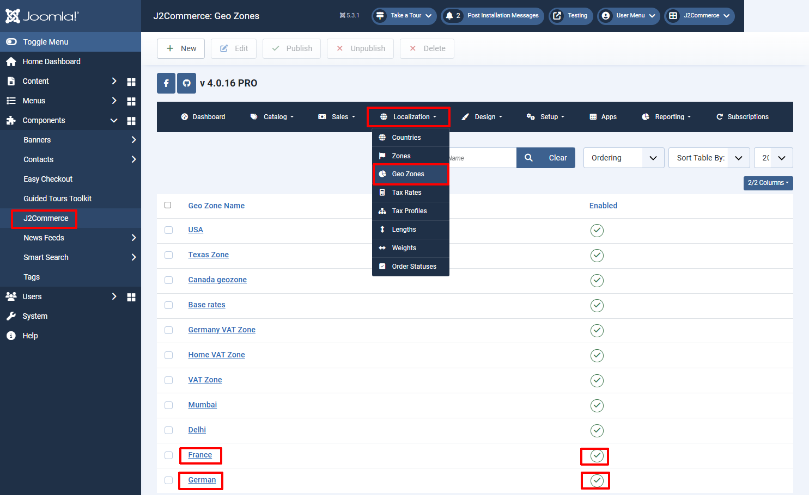

# Table Rate Shipping

The table rate shipping plugin extends J2Commerce’s default standard shipping options, giving you highly customizable shipping options.

Define multiple shipping rates based on location, price, weight, or item count.

* Add multiple shipping rules per shipping zone
* Several types of calculation methods: Per order, per item, per class
* Add rules based on Weight, Number of items, and price.
* Add costs per row, per item cost, a percentage, and per weight unit

By using Table Rate Shipping, it is possible for you to create complex rules for applying shipping costs.

You can define multiple rates based on the customer’s address, have multiple rates per zone, and add rules based on product weight, number of items, shipping group, and price.

**Requirements**

* with PHP 8.1.0 +
* Joomla! 4.x/ Joomla! 5.x +
* J2Commerce / J2Store 4.x +

**Step 1:** Purchase:

Go to > J2commerce.com > Extensions > Shipping Plugins > Table Rate Shipping> Add to Cart.

<figure><figcaption></figcaption></figure>

**Step 2:** Download:

After you purchase the App, it will be in your “My Downloads” section. Go to your profile icon in the upper right corner > My downloads > Search “Table Rate” > Available Versions

<figure><figcaption></figcaption></figure>

Next, View Files > Download Now > save it in a location you will remember

<figure><figcaption></figcaption></figure>

<figure><figcaption></figcaption></figure>

**Step 3:** Installation:

Step 1: Go to System > Install > Extensions > Upload Table Rate zip file.

<figure><figcaption></figcaption></figure>

**Step 4:** Publish:

Make sure you enable the App. Go to J2Commerce > Setup > Shipping Methods > Find Table Rate and click Enable

<figure><figcaption></figcaption></figure>

Once activated, open the plugin and start configuring the shipping method.

How the table rate shipping works: When a customer checks out items in their cart, the plugin looks at the customer’s destination (geozone) and then uses the table of rates you created to calculate total shipping. Each geozone can have its own rules, or multiple sets of rules, based on your shipping requirements.

You have to create shipping zones and their rules for calculating the shipping correctly.

**Configuration:**

Plugin settings: Before starting to create a shipping method, you will have to select the weight unit globally. Handling cost is optional.

<figure><figcaption></figcaption></figure>

**Shipping Rules:** Navigate to the Shipping Rule tab and start creating a shipping method by clicking on the ‘Add Shipping Method’ button.

<figure><figcaption></figcaption></figure>

**Method title:** Give the name of your shipping method. For example: Table Rate

**Geo Zone:** You can assign the shipping method to multiple zones. So that the shipping cost will be calculated by checking the customer’s destination address.

**User group:** Do you have a different price for different customers? And also want to define the shipping cost for different customers? It's also possible with this advanced shipping plugin. The shipping method can be assigned to a single or multiple user groups, so that the shipping cost will be applied to the customer who is associated with the user group selected here.

**Shipping tax:** If you would like to include tax in the shipping tax, you will have to select the tax profile here.

**Maximum shipping cost:** You can assign a maximum shipping cost to a method. For example, if the shipping total calculated is greater than the maximum cost, the price is decreased to the maximum cost amount.

**Calculation type:** Here you can decide how the plugin should calculate the shipping cost. The plugin provides three types of calculation methods:

* Per order: This type of calculation method calculates the shipping cost for the entire cart. If there are multiple shipping costs in the cart, the group with the highest priority will be used. These can be set in the plugin that appears underneath the rate table when per order is selected.
* Per item: This type calculates the shipping cost by checking each item in the cart with the rates defined in the plugin.
* Ship group: Each shipping group in your cart is totaled and offered at a final rate.

**Handling cost per item:** Apply an additional fee to the shipping cost calculated per item, per order, or per shipping group.

**Minimum cost per item:** Set a minimum cost for the calculated item. The item calculated could be an individual item or a shipping group based on the above settings.

**Maximum cost per item:** Set a maximum cost for the calculated item. The item calculated could be an individual item or a shipping group based on the above settings.

<figure><figcaption></figcaption></figure>

**Shipping Rule:** After filling in all the fields on the shipping method, click save, and you will be asked to create a shipping rule for the shipping method you created.

Click on the Add Rule button to create a shipping rule.

<figure><figcaption></figcaption></figure>

**Shipping** Grou&#x70;**:** If you would like to calculate the shipping based on shipping group, then you will have to select the shipping group here. If you don’t want to use a shipping group, select No group.

**Condition:** This parameter allows the customer to decide what product information the plugin should use to calculate shipping rates. Your options are:

* Price – the price of the items
* Weight – the weight of the items
* Item Count – the number of an individual item

**Min-Max:** The minimum and maximum range should be given here for the chosen condition. For example, if you have chosen Item count as a condition, then you have to give the quantity range using these parameters.

**Break:** This option is used to stop calculating further shipping rates if you reach this row of the table.

**Abort:** Enable this option to disable all rates or the shipping you are editing if the row you are editing matches any item/group being quoted.

**Row cost:** This is the base cost for shipping. This cost will be added to the shipping cost.

**Weight cost:** Enter the cost per weight unit for the products.

**Percentage (%) cost:** The percentage of the product's total should be used to calculate shipping.

**Shipping** grou&#x70;**:** Shipping groups are used to restrict shipping by products. For example, you may have a product that weighs a very large amount and needs a special shipping price. In this case, you can use a shipping group and create a shipping rule for that specific product. Multiple shipping groups can be created here. For example, special, normal, store pickup.

<figure><figcaption></figcaption></figure>

You can create tables of rates that apply to different shipping groups. This gives you considerable flexibility when creating shipping methods.

<figure><figcaption></figcaption></figure>

After creating a shipping group, you will have to associate this shipping group with the product that needs a special shipping charge.

Go to the specific product > J2Commerce tab > Apps tab > Table Rate Shipping

<figure><figcaption></figcaption></figure>

**Examples:** Let's see some of the working examples below:

**Create a shipping method with a shipping group:**

Consider a store owner who is selling a Teddy bear. His customers often buy multiple quantities of teddy bears. He wants to charge the shipping cost of $4 and also would like to charge $2 for each teddy bear. Let's see how to create shipping rules for this scenario:

* **Create a geozone:** If you want to apply a shipping charge to the customers only from the United States, then you will have to create a geozone for the country United States. Go to J2Commerce Dashboard > Localization > Geo Zone > New

<figure><figcaption></figcaption></figure>

* Then, go inside the Table Rate plugin (Settings > Manage > Plugin > Table Rate Shipping) and create a new shipping method.
* Give a name for your shipping method and choose the Geo Zone and user group.
* Choose Ship group as your calculation type and save. (Note: You should have already created a shipping group under the Shipping Group tab at the top).
* Save
* Now, create a new shipping rule like in the image below. For example:
  * Choose your Shipping Group: Sample
  * Condition - Item count
  * Min-Max - 1 to 100
  * Item cost - $2
  * Row cost - $4

See the table below :

<figure><figcaption></figcaption></figure>

When customers reach the purchase cap, they will be charged as below

**(1) Teddy bear: $6; (2) Teddy bears: $8; (3) Teddy bears: $10**

**Applying multiple rules to the same shipping group:** Consider the store owner who would like to apply shipping on the basis of the item’s quantity. For example, when people buy more than 2 teddy bears, then the shipping charge should be $16. So the original rate should be edited to a Minimum of 1 and a maximum of 2, and then add the following shipping rule:

For example:

* Shipping Group: Special
* Condition: Item count
* Min : 3 and Max: 1000
* Item cost: $2
* Row cost: $16

The table setup should be as below:

<figure><figcaption></figcaption></figure>

When customers purchase Teddy bears, they will be charged as below:

* (2) Teddy bears cost $8 for shipping (2\*2) + 4
* (3) Teddy bears cost $22 for shipping (3\*2) + 16

Calculating shipping cost by weight: The shop owner decided to charge for shipping based on weight. It’s more cost-efficient for him to ship by weight, so he plans to restructure his shipping rates as below:

0-0.5kg: $3.75

0.5-1kg: $5.30

1kg-2kg: $9.50

In this case, we are going to calculate the shipping based on the weight of the entire order, so choose **Per Order** as the calculation type. You need to create three rows, one for each rule you wish to create. These will apply to any shipping group, with the weight condition, and a minimum and maximum weight applied.

Use cases

Shipping products based on Geo zone: Consider that the store owner would like to ship some of his products to Mumbai and some products to Delhi. Configuring this type of shipping cost could be achieved by using the Shipping group.

Here is the scenario: **The new example below will be for T-shirts**

* Product ‘A’ will be shipped from Mumbai
* Product ‘B’ should be shipped from the Delhi warehouse
* If the customer adds both products ‘A’ and ‘B’ to the cart, so shipping charges of both should be summed and shown because Product ‘A’ ships from Mumbai and Product ‘B’ from Delhi, so the user has to pay two shipping costs.

Let me explain how to configure the table rate shipping based on the above scenario.

**Step 1:** Create geo zone: Since the products are going to be shipped from different places, the geo zones have to be created separately.

The below screenshot shows that we have created two geozones, “Mumbai” and “Delhi”.

<figure><figcaption></figcaption></figure>

**Step 2:** Creating a Shipping Group

Since the shipping cost has to be calculated based on the shipping group, there are two shipping groups that need to be created.

* Mumbai
* Delhi

<figure><figcaption></figcaption></figure>

Then, assign the shipping group to the products accordingly.

**Cap:** We considered that this product would be shipped from Mumbai. So we assigned the shipping group “Mumbai” to this product. If you edit the T-shirt product the navigate to the J2Commerce (J2Store Cart) tab > Apps tab, you would see the shipping group associated in the Table Rate Shipping section..

<figure><figcaption></figcaption></figure>

**T-shirt:** Considering this will be shipped from Delhi so we assigned the shipping group “Delhi” to this product.

**Step 3:** Creating shipping methods

We have created two shipping methods using the Table Rate Shipping plugin.

* **Shipping cost 1:** This is to apply the shipping charge for the products to be shipped from Mumbai.
* **Shipping cost 2:** This is to apply the shipping charge for the products to be shipped from Delhi.

Now, open the table rate shipping plugin ( go to system > Manage > Plugin > Table Rate) and create the shipping method for Mumbai called “Shipping cost 1”. Assign the geo zone “Mumbai”.

Save

Create the Shipping Rule using the Shipping Group.

The ‘shipping cost 2’ has been created similarly to the ‘shipping cost 1’. Notice that the Row Costs are reversed.

<figure><figcaption></figcaption></figure>

Frontend screenshots:

Shipping charge applies when adding product ‘A’:

\\

Shipping charge applies when adding product ‘B’

When adding both products, the shipping cost is calculated by adding both charges.

\\

2\. Applying shipping charge based on location and quantity: Consider that the store owner would like to set different shipping costs for Germany and France based on both order quantity and item quantity. Let’s see the scenario below:

Scenario:

* For customers from Germany, TOTAL of all Items from 1 to 12 = Flat shipping rate 7.20€ total of all Items from 13 to xxx = shipping rate per Item 0.60€ That means, total of all Items =1 then the Shippng rate is 7.20€ total of all Items =12 then the Shippng rate is 7.20€ total of all Items =13 then the Shippng rate is 7.80€ total of all Items =30 then the Shippng rate is 18.00€
* For customers from France, TOTAL of all Items from 1 to 12 = Flat shipping rate 12.00€ total of all Items from 13 to xxx = shipping rate per Item 1.00€ That means, total of all Items =1 then the Shippng rate is 12.00€ total of all Items =12 then the Shippng rate is 12.00€ total of all Items =13 then the Shippng rate is 13.00€ total of all Items =30 then the Shippng rate is 30.00€

Here are the steps to configure the table rate shipping according to the above scenario:

**Step 1:** Creating geo zones:

Since the shipping costs are going to be calculated based on Germany and France, you will have to create two different geozones.

<figure><figcaption></figcaption></figure>

**Step 2:** Creating a shipping method for **scenario ‘1’**

1. Create a shipping method and give it a name. For example, we named it “Shipping cost 1”
2. Choose Germany for the Geo zone
3. Select the user groups.
4. Choose Per Order as a Calculation type
5. Save.
6. Click on the Add Rules button to add shipping rules to the shipping method. Since the shipping cost will be different based on order quantity and item quantity, you will have to create two shipping rules.

Here is how the shipping rule has to be created:

**Shipping Rule 1:**

a: Shipping Group: Any Group

b: Condition: Item Count

c: Min - Max: 1 to 12

d: Row cost: 7

**Shipping Rule - 2:**

a: Shipping Group: Any Group

b: Condition - Item Count

c: Min - Max - 13 to 999

d: Item cost - 0.6

e: Save.

<figure><figcaption></figcaption></figure>

**Step 3:** Creating a shipping method for **scenario 2:**

Similar to the above step, create a shipping method.

1: Choose France for the Geo zone

2: Select the user groups.

3: Choose Per Order as a Calculation type

4: Save

Now create two shipping rules for this method as per below:

**Shipping rule 1:**

a: Shipping Group: Any Group

b: Condition - Item Count

c: Min - Max - 1 to 12

d: Row cost - 12

**Shipping rule 2:**

a: Shipping Group: Any Group

b: Condition - Item Count

c: Min - Max - 13 to 999

d: Item Cost - 1

e: Save

<figure><figcaption></figcaption></figure>

