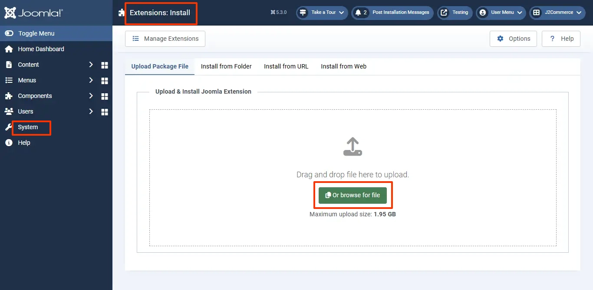

# Requirements and Installation

## Requirements 

1. PHP 5.4+
2. J2Commerce 3.2.20 or above
3. Joomla 3.4.x or above

## Download App 

1. Go to J2Commerce website and make sure you are logged in.&#x20;
2. Click on your profile dropdown in the top right corner and click on My Downloads. In the search bar type in Subscriptions or Membership.&#x20;
3. When the app is shown, double click on it to open it.
4. Click View Files
5. Click Download Now

<figure><figcaption>
App Search
</figcaption></figure>

<figure><figcaption>
App Search
</figcaption></figure>

<figure><figcaption>
View App Files
</figcaption></figure>

<figure><figcaption>
Download App
</figcaption></figure>

## Install App 

1. After downloading the app, go to the backend of your site and go to System > Install > Extensions.
2. Drag and drop your zip folder or click on Browse Your File. Don't unzip the folder

<figure><figcaption>
Install the app
</figcaption></figure>

<figure><figcaption>
Install the app
</figcaption></figure>

1. After installing the app, go to J2Commerce > Apps and enable Subscription Products app.

<figure><figcaption>
Enabling the app
</figcaption></figure>

1. Once enabled, open the app and configure the basic settings of the app.
