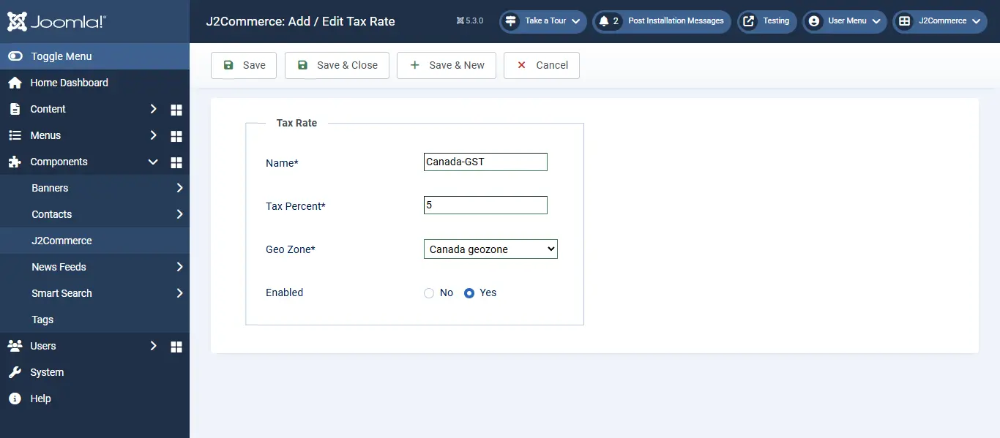

# Recommended Tax configuration for Canadian Stores

This is an example setting for stores in Canada. For detailed information on tax, please consult an expert.

> NOTE: The example given below, assumes you have a store in Canada, Saskatchewan and you charge 5% GST and 5 % Saskatchewan-PST on the goods sold to customers.

## Step 1 : Create a geozone for Canada 

Go to Components > J2Commerce > Localisation -> Geozones -> New

<figure><figcaption>
Geozone Canada
</figcaption></figure>

<figure><figcaption>
Geozone Canada
</figcaption></figure>

Geozone Name: Canada geozone

Country : Canada

Zone : \*

## Step 2: Create a tax rate 

Go to Localisation -> Tax Rates -> New

<figure><figcaption>
Tax Rate Canda
</figcaption></figure>

<figure><figcaption>
Tax Rate Canda
</figcaption></figure>

Name : Canada-GST

Tax Percent : 5

Geo Zone : Canada geo zone

Enabled: Yes

## Step 3: Create another tax rate for Saskatchewan-PST 

Go to Localization -> Tax Rates -> New

<figure><figcaption>
Saskatchewan Tax Rate
</figcaption></figure>

Name : Saskatchewan-PST

Tax Percent : 5

Geo Zone : Canada geo zone

Enabled: Yes

## Step 4: Create a tax profile and rules 

Go to Localization -> Tax Profiles -> New

<figure><figcaption></figcaption></figure>

<figure><figcaption></figcaption></figure>

Name: Canada Tax Class

Enabled: Yes

Tax rules

Click Add

Rate: Canada - GST

\*\*Associated Address: \*\* Shipping

Click Add

Rate: Saskatchewan-PST

\*\*Associated Address: \*\* Shipping

## Step 5: Configure tax settings 

Go to Setup -> Configuration -> Tax

<figure><figcaption></figcaption></figure>

<figure><figcaption></figcaption></figure>

Prices Entered with Tax: No, I will enter prices EXCLUSIVE of tax

Calculate tax based on: Shipping address

Default Customer address: Store address

Display prices in product pages: Excluding tax

Display prices in cart / checkout : Excluding tax

Apply discounts : Before tax

Save.

## Step 6: Create a product and choose the tax profile 

J2Commerce uses Joomla! articles as products. So go to Article Manager and create a New Article / Product (If you sue any other catalog source like Zoo or Sebold, you should head there).

Product creation steps are explained under the topic Products.

Here let us just see how to choose the tax profile

Go to J2Store Cart tab -> General tab

Tax Profile : Canada Tax Class

<figure><figcaption></figcaption></figure>

IMPORTANT If you do not choose the tax profile, then tax will not apply in the store front.

## Video Tutorial: 


