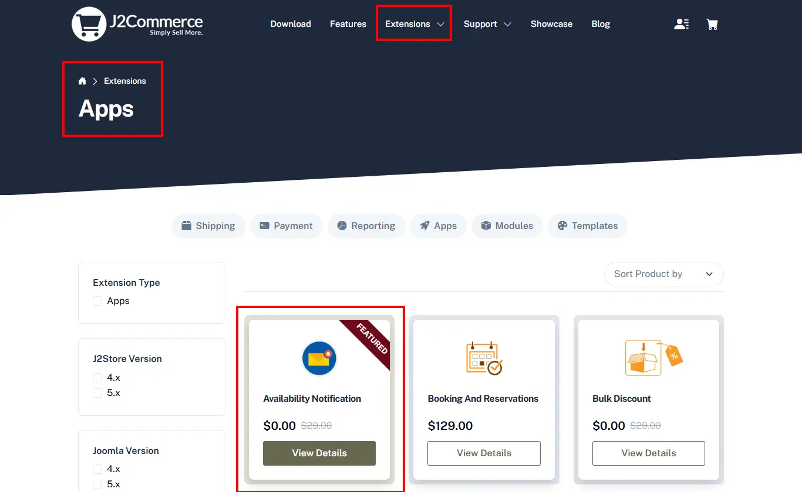

# Availability-notification

This app allows store owner to notify customer regarding stock availability. If product’s stock goes to “OUT OF STOCK” then Notify Me button will be generated where customer can type his / her Email id and click Notify Me. So when product’s stock becomes available, customer get an email notification.

**Requirements**

* PHP 8.1.0 +
* Joomla! 4.x/ Joomla! 5.x +
* J2Commerce / J2Store 4.x +

**Installation**

**Step 1:** Go to our [J2Commerce website](https://www.j2commerce.com/) > Extensions > Apps

**Step 2:** Locate the Availability Notification App > click View Details > Add to cart > Checkout.&#x20;

**Step 3:** Go to your My Download under your profile button at the top right corner and search for the app. Click Available Versions > View Files > Download Now

**Step 4:** Go to System > Install > Extensions > Download the app

.webp>)

**Step 5:** Go back to System > Manage > Extensions.

.webp>)

**Step 6:** Search for the app and enable it.

Once enabled, you can open it to setup the Basic Settings of the app. To open the app go to Components > J2Commerce > Apps

## Basic Settings 

**Delete Email after send email to customer ?**

Choose YES will delete the email id from Email text box once the email has been sent.

**Button Text**

The Default button text is "J2STORE\_APP\_OUTOFSTOCK\_NOTIFY\_ME". You can enter the custom text for the button. If you are using multilingual site, create language override for the language constant.

**Email Body**

It is the Email body section. Text entered here will be displayed in the Body of the email.

**Email Subject**

It is the Email subject section. Text entered here will be displayed as Subject of the email.

How to track the users?

With this plugin, you are able to manage the users who are requesting Stock notification via Email.

On top of the app, you can see Manage User button. Click on that button to view the users.

Refer the screens below

**Frontend**

When Product’s stock goes out of stock, you will get the screen like below

After sending email, you will get thank you message like below screen

**Support**

Still have questions? You can contact support: [Click here](https://www.j2commerce.com/support)

Thank you for using our extension.
