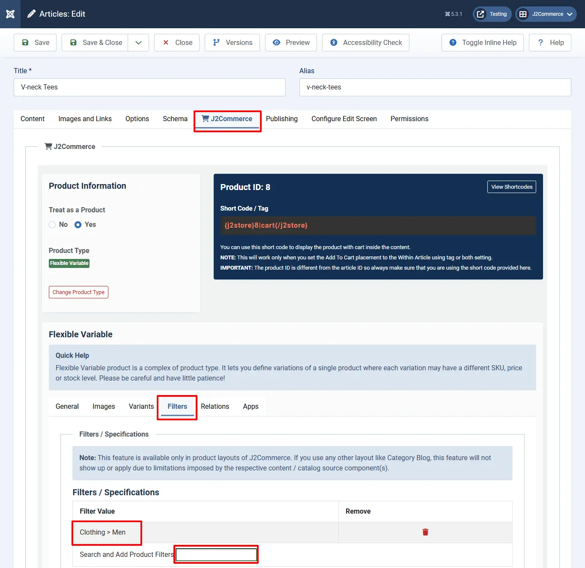

# Product filters

These are used to narrow out the search for a particular product.

In this page, first Filter Groups are created, and in each group, some Filter Names will be added, and based on the Filter Name, products will be searched.

* E.g., Filter Group: Clothing
* Filter Names: Men, Women, Kids

:::note
NOTE: If you are adding a large number of filters (1000+), make sure "max_input_vars" in your PHP.ini is set to a higher number as well
:::

**Step 1:** You have to create the filter before you can add it to your products. So let's create the filter first and then we will add it to a product.&#x20;

Go to Components > J2Commerce > Catalog > Filters.

**Step 2**: The filter page shows all of your current Filter Groups, and now we are going to create a new Group called 'Clothing'

.webp>)

**Step 3:** Naming the new 'Filter' group and its filter values. In the example below, the Filter Group is 'Clothing' and its filter values are 'men', 'women', 'kids'

.webp>)

Now that you have created the filters, you can add them to your products. If you need to add more filters in the future for different products, just go back into the Filter Group called 'Clothing' and add more filter values

**Adding filters to products**

* Go to Content > Articles > Open your product
* Move to the 'J2Commerce' (or J2Store cart) tab
* Navigate to the 'Filters' tab
* Type the first few letters of the unique name of the product filters in the search box.
* It will display the search results in a dropdown. Choose the filters from the dropdown and save the product.
* If your filter doesn't show up in this section, then it's because you forgot to add it to the filter group in **step 3** mentioned above.

## Frontend 

## Video tutorial: 

