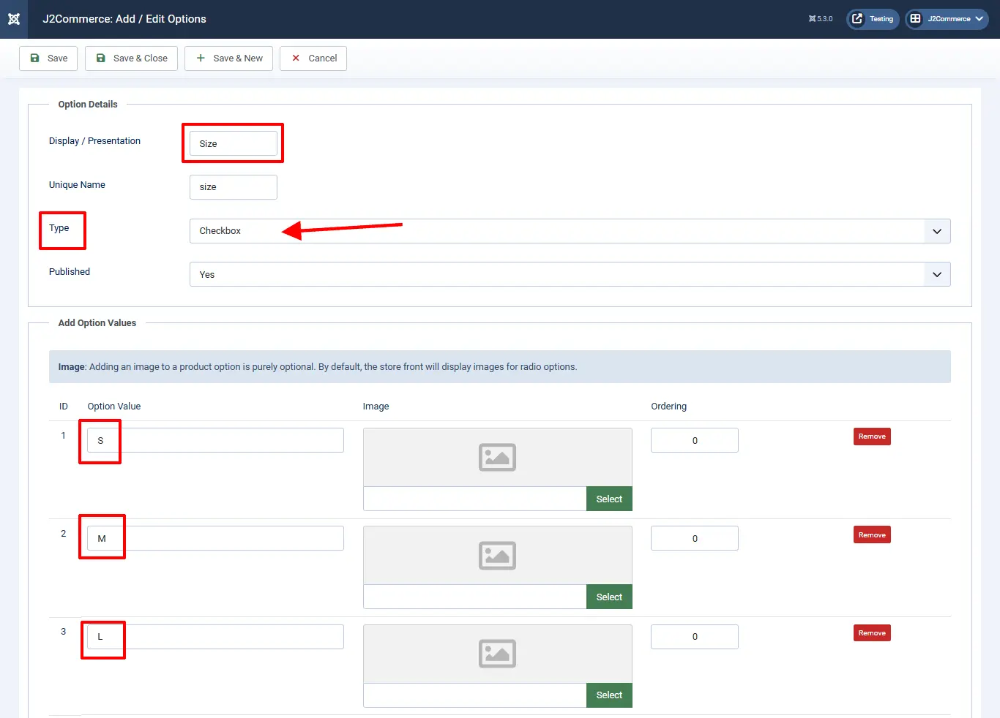
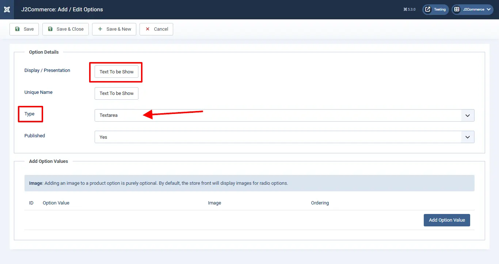
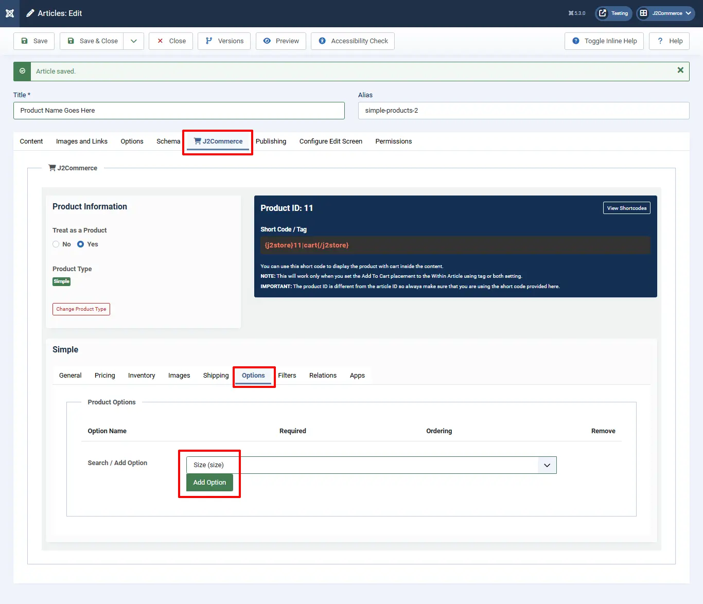
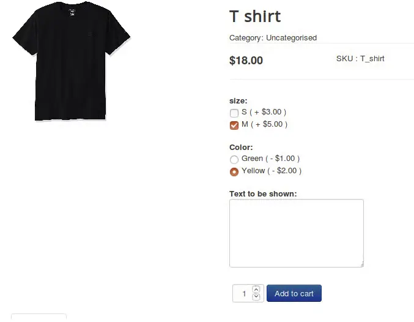

# How to create options and add them to your products

Who doesn’t prefer choices when they wish to buy their favorite t-shirt ? Obviously, your users would love when the products have additional options. J2Commerce allows you to create [options of various types](https://docs.j2commerce.com/catalog/options)

Here is how you could create product options and add them to your products.

## Instance: 

Lets suppose you are trying to sell a customizable t-shirt. So this t-shirt has options called colour, size and requests users to fill in the custom text that they will have to print on the t-shirt.

Now that we know the requirements, let us get into the process of setting the options up.

### Creating the options 

* Navigate to **Components > J2Commerce > Catalog > Options.** Click on the 'New' option.

* Enter the unique name, display or presentation (in our case, let us create color of the type radio and size of the type checkbox first).
* Choose the type and set the published status.
* Add option values, images (they would be displayed only if the option type is radio) and specify the ordering (the order in which they would be listed in the product part).

In the examples below, we are creating 3 different Options. Colour, Size, and Text

* Create a text area type option for collecting the text to be displayed on the shirt.

### Adding the options to your product 

Now, it's time to add them to your product, the t-shirt.

* Navigate to Content > Articles.
* Click on your product.&#x20;
* Click on the J2Commerce (J2Store Cart) tab.
* Select the options tab.

* Add all three options and save the article once.

.webp>)

* Click on the Set option values next to the size and color options, one at a time. See image below.

The pop-up window will allow you to select each attribute that is offered for each option. Every time you add a new attribute, it auto-saves. Click the X in the top right corner when finished.

.webp>)

You can also set special pricing for each attribute if different than the main product. In the example below, we have set the size Small to be offered for $3 more and the Mediumium to be $5 more than the rest. The Prefix section determines if it's going to be more or less (+/-) than the main product price.

The example below shows what it looks like on the frontend

