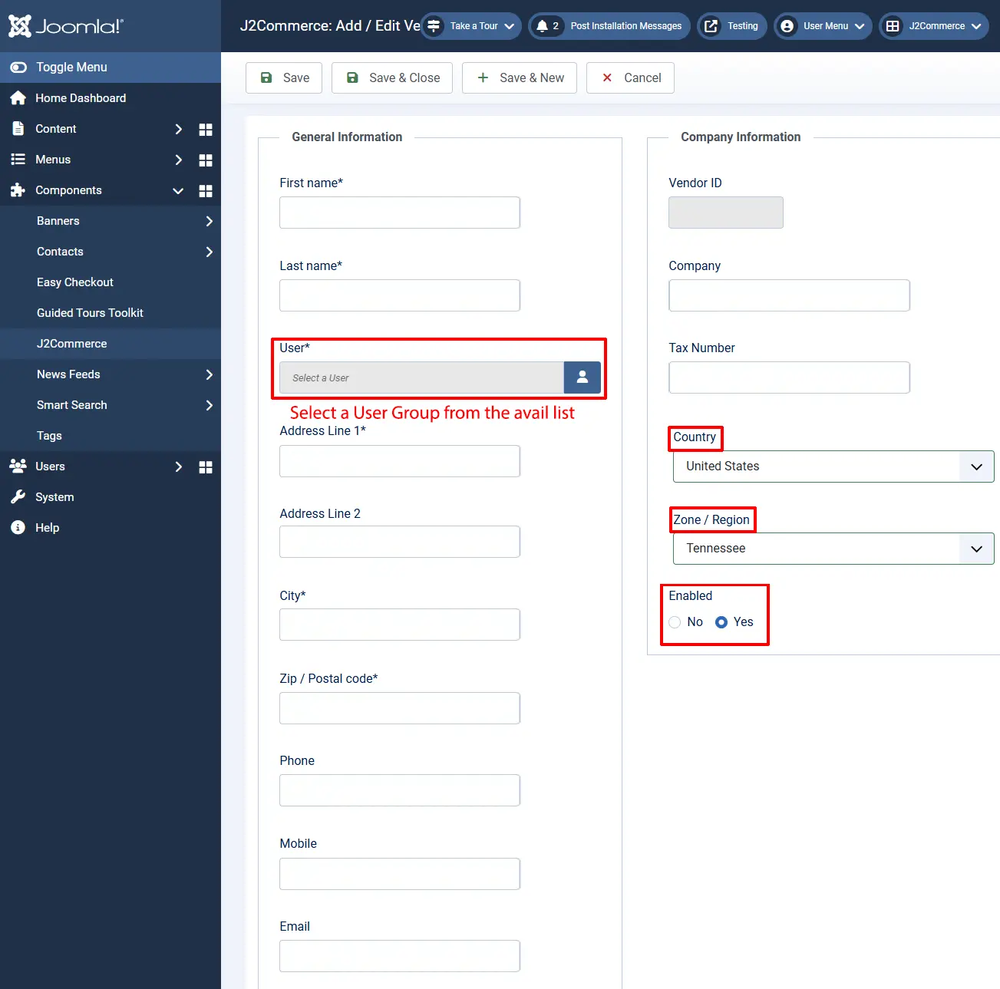
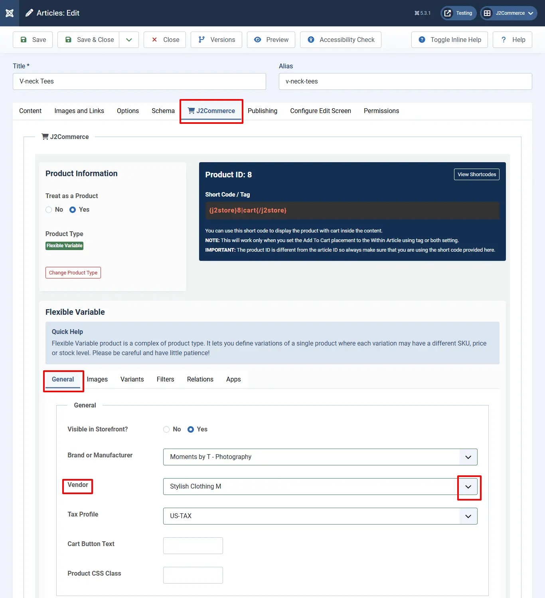
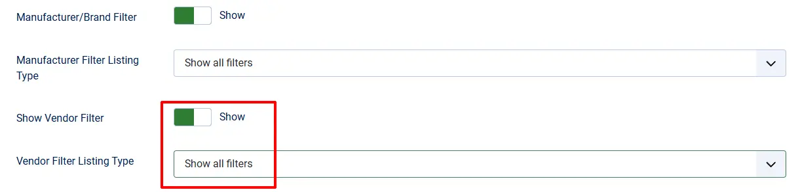

# Vendors

This is a database of vendors for products available in J2Commerce.

There are many products available in J2Commerce for customers. If the customers want to purchase the desired products, vendors must be available to deliver the products to them. This vendor database facilitates the customers to choose the vendor of their choice. They are listed with complete details, including their zone and country. So customers can easily manage to find a vendor.

Though the vendor is available in the database, the same must be enabled to be listed for customer selection.

Vendors are listed with the following details:

## General Information 

* First Name
* Last Name
* User
* Address
* City
* Zip
* Phone and Mobile

## Company Information 

* Company
* Tax Number
* Country
* Zone

Step 1: Create a Vendor by navigating to Components > J2Commerce > Catalog > Vendors

Step 2: Click 'New'

See the image below on adding a new vendor.&#x20;

* Fill in all of the vendor details.&#x20;
* Select a 'user' from the User Group from the available list
* Set the 'Country' and 'Zone'
* Enable to 'Yes'

## Associating the vendor with a product

Once created, you can associate the vendor with your products

Open your product by going to Content > Articles. Open your product.

Click on the J2Commerce (or J2Store cart) tab > General, and choose the appropriate vendor for the product.

Associating the Vendor with products

* Navigate to Menus > Manage. Find your product
* Open your product menu > Category View Options tab.

* Scroll down to the Filter section and enable the options as indicated below:

Users can now view the available vendors and filter products based on vendors on the storefront:

