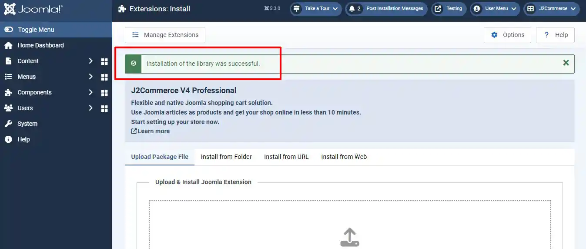
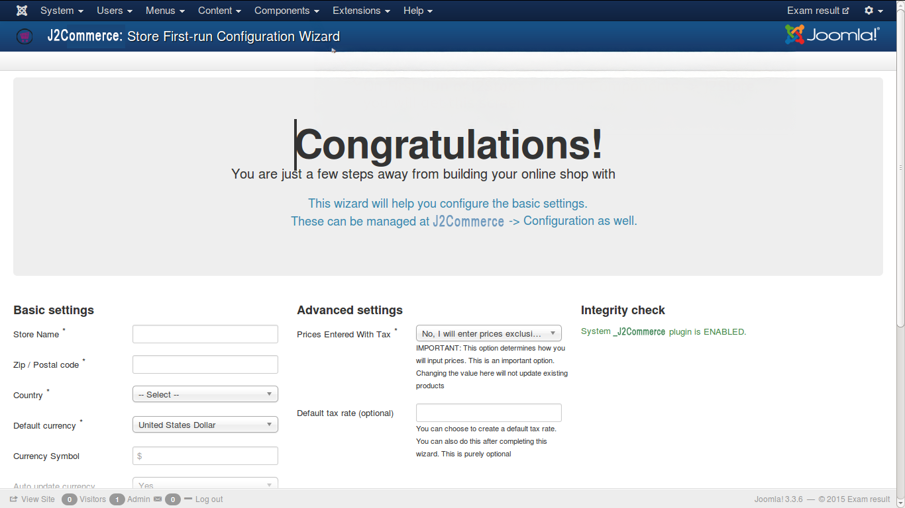

# Installation

To install J2Commerce, you need J2Commerce archive downloaded or purchased from [click here](https://www.j2commerce.com/download).

## J2Commerce Versions 

There are four plans available in J2Commerce shopping cart extension.

* Basic
* Standard
* Professional
* Developer

Have a look at the image below:

.webp>)

**Basic** plan is free and gives you access to download J2Commerce Core version from

To install J2Commerce, you need J2Commerce archive downloaded or purchased from [click here](https://www.j2commerce.com/download).

Remaining are for-a-fee plans which gives access to J2Commerce PRO version. You can choose any of the four and get a copy of the extension.

## Installation 

In your Joomla control panel side menu, go to System > Install > Extension, as illustrated below.

.webp>)

When you click here, you will be directed to the screen where you can select the downloaded/purchased packaged. See the image below:

As illustrated, select the package file and click ‘Upload and Install’.

J2Commerce is now installed and you will get this success message, as illustrated below.

Now go to the side menu > Components > J2Commerce, you will get the configuration screen as shown below: Enter the details for your online store and click save.

And here is the J2Commerce Dashboard.

Now, you are powered with J2Commerce. Build your online store within minutes and happy selling!
