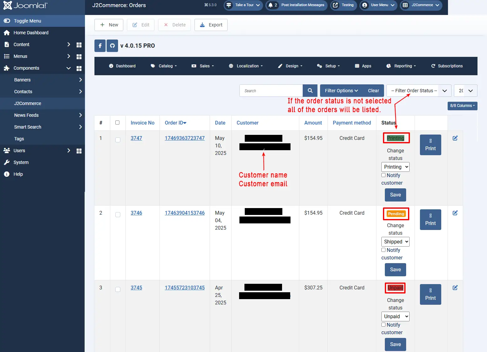
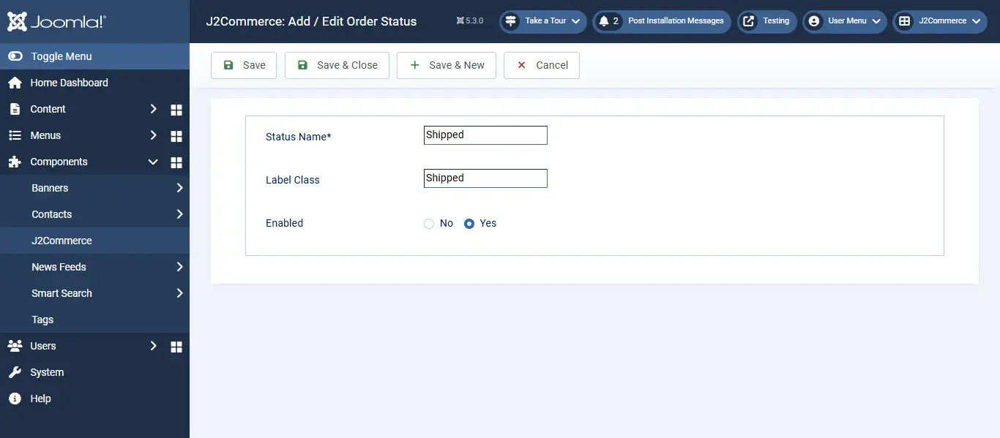
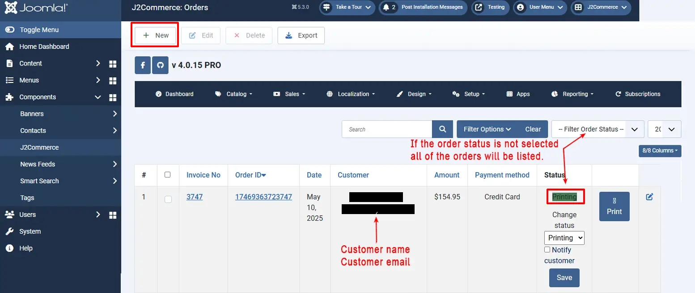
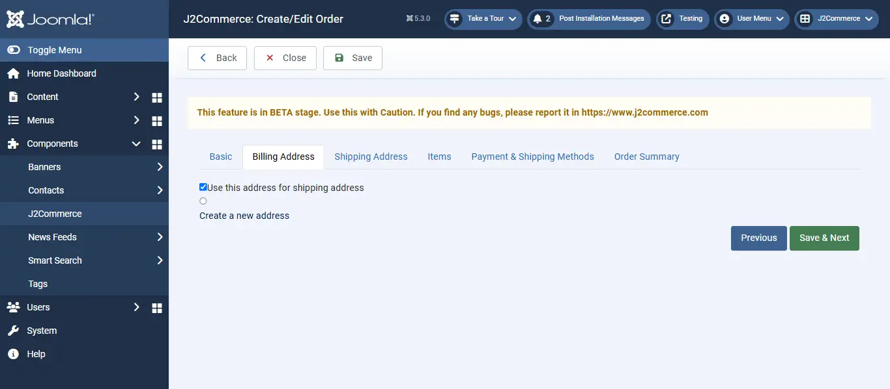
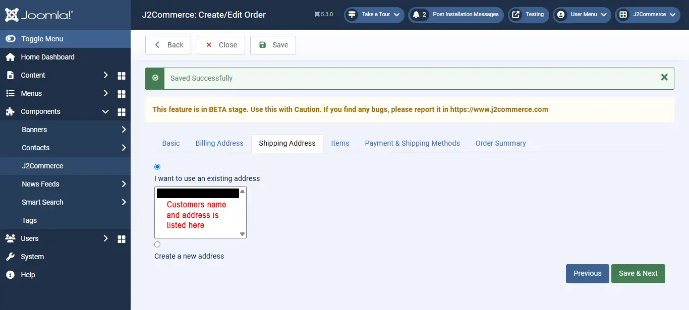
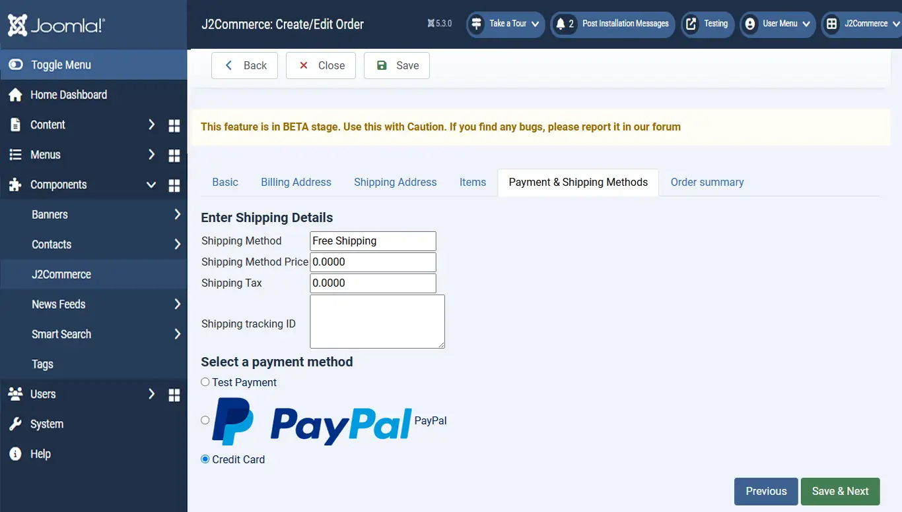

# Orders

the yourA customer views the product and completes the checkout process, it is transformed into an order.

To locate your orders, go to Components > J2Commerce > Sales > Orders

## Order statuses 

Orders are listed here according to their statuses. They are as follows:

**New**

When the customer reaches the last step of the checkout, the order is saved with the status NEW. This means the customer has NOT PAID. It is an UNPAID order.

**Confirmed**

As soon as the customer makes a successful payment, the order status is marked CONFIRMED.

**Failed**

If the payment is not successful or if there is an error message from the gateway due to validation or other reasons, then the order status is marked as - FAILED.

The above is the primary workflow.

**Pending**

This will be used sometimes with certain gateways (like PayPal). This usually means. Payment is successful. However, you will have to manually review this payment. Example: eCheck payments in PayPal take at least 5 to 7 business days to clear. Sometimes, PayPal marks a payment from customers from certain countries (Egypt, Nigeria, for example) as Pending, and would want you to review or it might go to their Fraud prevention team for a review. In those cases, the order is marked PENDING. This status is not used by all gateways

**Cancelled**

This is primarily for the administrator. (In a few gateways, if the customer cancels during the payment screen, the status is automatically marked as Cancelled). The store admin can mark an order as cancelled. In high-traffic sites that manage low inventory, there is an option to auto-cancel orders if the payment is not confirmed within XX time. J2Store has this option under the Inventory settings.

**Processed**

An internal order status for the store administrator. You can use it for any purpose you like, depending on your business nature.

Every order will possess some important information that explains it. They are:

* **Invoice No:** The number of the document that completes the process of that order.
* **Order ID:** ID for reference that tracks all the processing steps
* **Date:** The date on which the order is completed
* **Amount:** The total value of the order after billing
* **Payment Method:** The method by which the customer has paid for the order, viz., bank transfer, PayPal, money order, etc
* **Status:** Completed or still in process - like information

Check the image below to understand clearly.

You could also create custom order statuses by clicking on the New button under Components > J2Commerce > Localisation > order statuses > New as indicated in the screenshot below:

.webp>)

## Creating order from the backend 

J2Commerce allows you to send an invoice first and then collect the payment from the customer. This is possible by creating an order from the backend. Follow the steps below to create an order from the backend:

Go to Component > J2Commerce > Sales > Orders and click New on top left of the page.

From the resulting page, select date, user, and language, and then click on Save & Next at the bottom of the page.

Now you are in the Billing Address tab. Under this tab, choose the billing address of the customer or create a new one and then click on Save & Next.

Under the Shipping address tab, click on Create a new address if your customer’s shipping address is different from the billing address.

Now you are in the Items tab. Here, type two or three characters of the Product’s SKU. It will show you the available products. From the available products, choose your desired product and click on “Add item to order”.

The pop-up screen will be displayed, where you should click on the Add to cart button to add an item to the basket. Then, close the pop-up and click on Save & Next.

.webp>)

Choose your payment method and shipping charge under the Payment & Shipping method tab and click Save & Next.

At last, the order summary will be displayed. At the bottom of the page, you will see a calculate tax button. Clicking this button will calculate the text for this order.

If you would like to apply an extra charge to customers, use the Add fee feature at the order summary tab. Enter the fee name, fee amount, and choose the tax profile (if you want to charge an extra fee taxable), and then finally click on save order.

## Editing order from the backend 

You could edit the order by going to Component > J2Commerce > Sales > Orders.

You can see the orders listed in the table format. In the tabular column, select the checkbox of the corresponding order that has to be edited and then click the button at the top of the page.

**Another way:**

Open the order by clicking on the invoice number or the order ID.

Click on Edit at the top of the page and make the changes to the order.

**Adding shipping tracking ID**

If you have enabled shipping on your site, on the admin order history page, you can see the text box to enter the shipping tracking ID. Enter your shipping tracking ID and click save.

Now go to Component > J2Commerce > Design > Email Templates and add the short tag \[SHIPPING\_TRACKING\_ID] in your email template.
