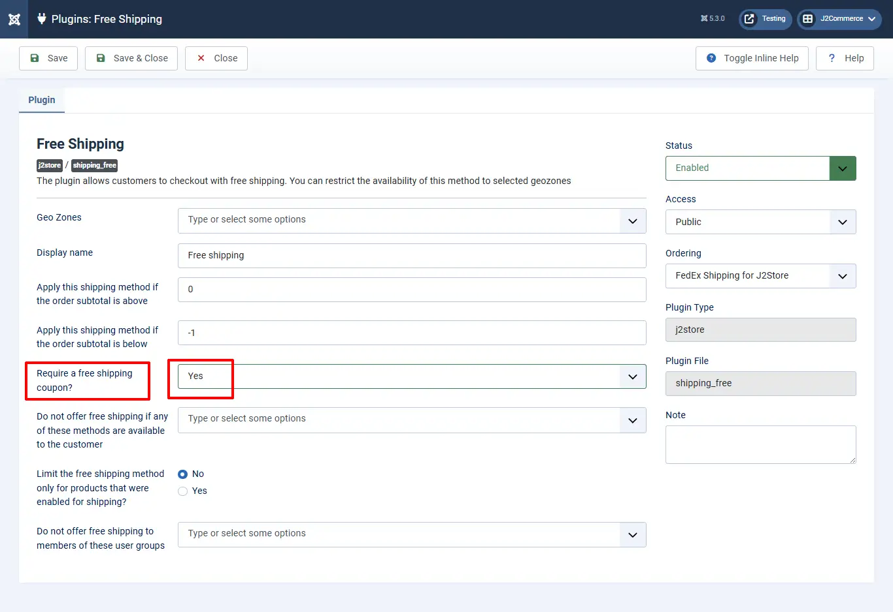

# How to create coupons for free shipping

This is J2Commerce PRO exclusive feature

Coupons preloaded with specific values enable customers to shop online with no shipping cost.

**Step 1:** Go to Components > J2Commerce > Sales > Coupons

Step 2: Click New and now you can create a coupon and add the details of the coupon, such as Coupon Name, Coupon Code, Published, Value, Valid from and Valid up to etc.

In the coupon creation page you will find an option \*\*FREE SHIPPING.\*\* Enable this to yes in order to make shipping free of cost.

Save 3: Save the created coupon, and a pop-up message stating “Coupon saved” will be displayed.

Step 4: Navigate to J2Commerce > Setup > Shipping methods. Click on the View option next to the free shipping plugin.

Step 5: On the free shipping page, you will find an option “REQUIRE A FREE SHIPPING COUPON”. Set the value to Yes.

Now, a free shipping coupon is created. You can customize the coupon by limiting the product category, Product, Users, usage etc.

**Note: This method will only show up when the user estimates the shipping cost by applying the coupon.**

**Video tutorial:**

