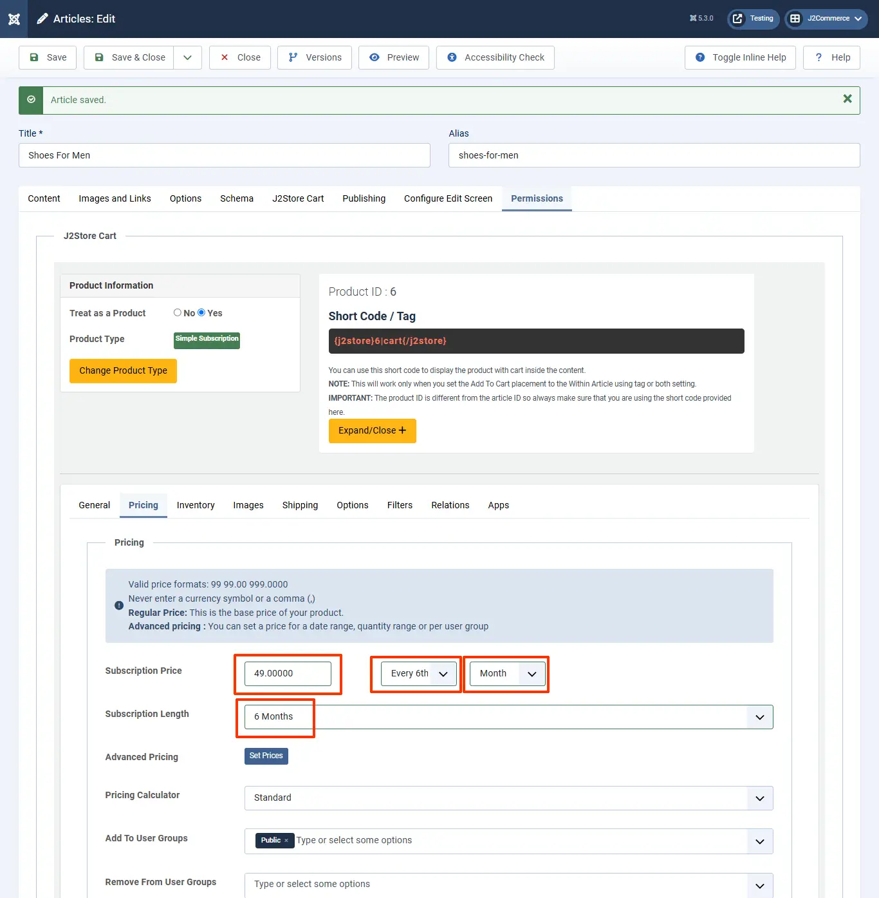

# Quickstart

A recurring subscription is nothing but auto-renewal. J2Commerce’s Subscriptions and Memberships app allows you to create recurring subscriptions. If you create a recurring subscription, the customers can auto-renew their subscription plan.

## Example 

The example given below assumes you have a store that sells hosting services and wants to collect $99 at the end of every 6th month.

### Step 1: Creating a product 

* Go to the Article Manager and create a new article
* Move to the J2Commerce (J2Store cart) tab
* Select 'YES' to treat asa  product
* Choose product type, either Simple Subscription or Variable Subscription.

.webp>)

### Step 2: Setting up the price based on recurring 

1. Now navigate to the Pricing section
2. Enter the price $99 in the price text box.
3. Next to the price text box, you can see two drop-downs. In the first dropdown, choose every 6th and choose the month from the second dropdown.
4. Set Never Expire to Subscription length.
5. Choose your user groups and save.

.webp>)

## How to create a non-recurring (one-term) subscription plan? 

Non-recurring is a single-term subscription in which the subscription will be terminated at a specific period and does not allow for auto-renewal. The subscriber will have to subscribe to the plan next time manually.

Let's see an example for a single-term subscription. For example, consider that you are providing service for $129 for one year.

### Step 1: Creating a product 

1. Go to the Article Manager and create a new article
2. Move to the J2Commerce (J2Store cart) tab
3. Select 'YES' to treat as a product
4. Choose product type, either Simple Subscription or Variable Subscription.

### Step 2: Setting up the price based on non-recurring 

1. Now navigate to the Pricing section
2. Enter the price $129 in the price text box.
3. Next to the price text box, you can see two drop-downs. In the first dropdown, choose every, and choose the year from the second dropdown.
4. Set 1 Year to Subscription length.
5. Choose your user groups and save.

Watch the video here:

## Creating 3-month subscription plan 

Refer below screenshots for setting na on-recurring 3-month subscription plan

Choosing duration

On Frontend

Watch the video:

## Creating 6-month subscription plan 

Refer below screenshots for setting na on-recurring 6-month subscription plan

Choosing duration

watch the video here:

